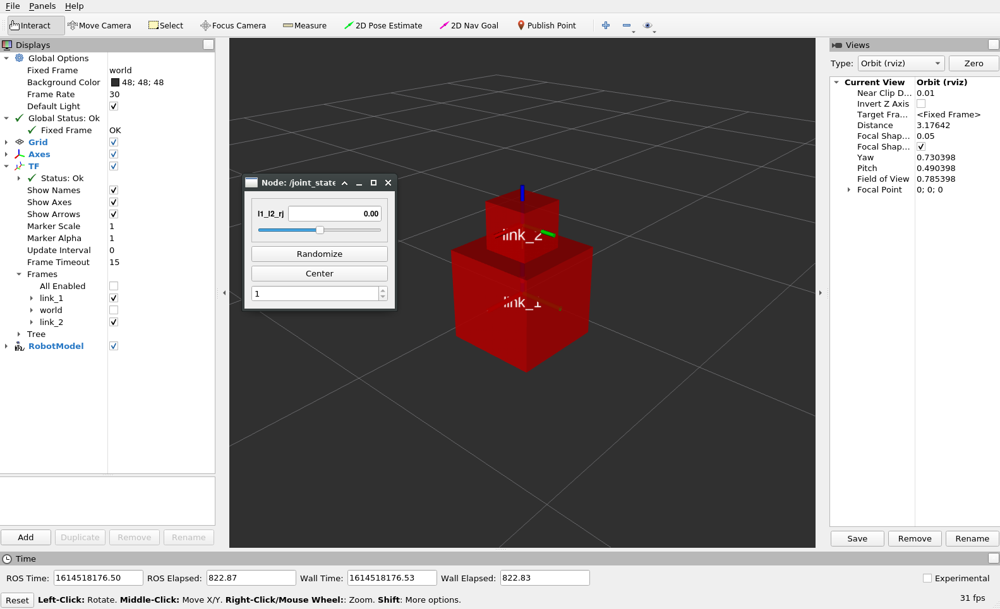

# Basic Robotics

Basic Robotics related software provided in ROS. This package includes a brief overview of facilities like visualization, robotic simulation and sensors that ROS provides. Essential softwares like `RViz`, `Gazebo` and frameworks like `MoveIt!` are explored here.

## Table of contents

- [Basic Robotics](#basic-robotics)
    - [Table of contents](#table-of-contents)
    - [Creating this package](#creating-this-package)
    - [Foreword](#foreword)
    - [Tutorials](#tutorials)
        - [Tutorial 0: Getting Started with RViz](#tutorial-0-getting-started-with-rviz)
        - [Tutorial 1: Visualizing data in RViz](#tutorial-1-visualizing-data-in-rviz)
        - [Tutorial 2: Building and visualizing robot models](#tutorial-2-building-and-visualizing-robot-models)
            - [Part 1: Visualizing a single link](#part-1-visualizing-a-single-link)
            - [Part 2: Jogging a two link manipulator](#part-2-jogging-a-two-link-manipulator)
        - [Tutorial 3: Gazebo and a Four Wheel Robot](#tutorial-3-gazebo-and-a-four-wheel-robot)
            - [Part 1: Simple Four Wheel Robot and Gazebo World](#part-1-simple-four-wheel-robot-and-gazebo-world)
    - [Launch Files](#launch-files)
        - [Launch C++ for Tutorial 1](#launch-c-for-tutorial-1)
        - [Launch Python for Tutorial 1](#launch-python-for-tutorial-1)
        - [Launch single link for Tutorial 2](#launch-single-link-for-tutorial-2)
        - [Visualize Jogging URDF robot for Tutorial 2](#visualize-jogging-urdf-robot-for-tutorial-2)
    - [C++ Nodes](#c-nodes)
        - [Laser Scan Publisher (C++) for Tutorial 1](#laser-scan-publisher-c-for-tutorial-1)
            - [Building](#building)
            - [Running](#running)
        - [TF Publisher (C++) for Tutorial 1](#tf-publisher-c-for-tutorial-1)
            - [Building](#building-1)
            - [Running](#running-1)
        - [Marker and Static TF Publisher (C++) for Tutorial 1](#marker-and-static-tf-publisher-c-for-tutorial-1)
            - [Building and Running](#building-and-running)
    - [Python Nodes](#python-nodes)
        - [Laser Scan Publisher (Python) for Tutorial 1](#laser-scan-publisher-python-for-tutorial-1)
            - [Building](#building-2)
            - [Running](#running-2)
        - [TF Publisher (Python) for Tutorial 1](#tf-publisher-python-for-tutorial-1)
            - [Building](#building-3)
            - [Running](#running-3)
        - [Marker and Static TF Publisher (Python) for Tutorial 1](#marker-and-static-tf-publisher-python-for-tutorial-1)
            - [Building and Running](#building-and-running-1)
    - [RViz configuration files](#rviz-configuration-files)
        - [LaserScan and TF for Tutorial 1](#laserscan-and-tf-for-tutorial-1)
        - [RobotDescription and TF for Tutorial 2](#robotdescription-and-tf-for-tutorial-2)
    - [URDF Files](#urdf-files)
        - [Single block for Tutorial 2](#single-block-for-tutorial-2)
        - [Two Blocks for Tutorial 2](#two-blocks-for-tutorial-2)
            - [Checking URDFs](#checking-urdfs)
    - [XACRO Files](#xacro-files)
        - [Simple Four Wheel Bot for Tutorial 3](#simple-four-wheel-bot-for-tutorial-3)
    - [Reference](#reference)

## Creating this package

This package was created using the following commands

```bash
cd ~/ros_workspaces/learning_ws/src
catkin_create_pkg basic_robotics
```

The dependencies will be added later

## Foreword

As this package deals with more practical things, there is relatively less code in this and more of tutorial like exercises. When reading this file, you may either traverse from top to bottom (recommended for beginners) or navigate through [table of contents](#table-of-contents). If you are a beginner, it may be more beneficial to go through the [tutorials](#tutorials).

## Tutorials

Short tutorials included in this package made to cover essential concepts. They are as follows

| S. No. | Name | Notes |
| :--- | :--- | :--- |
| 1 | [Getting Started with RViz](#tutorial-0-getting-started-with-rviz) | Launching RViz and terminologies |
| 2 | [Visualizing data in RViz](#tutorial-1-visualizing-data-in-rviz) | Visualize `TF`, `Marker` and `LaserScan` using dummy publishers |
| 3 | [Building and Visualizing Robot Models](#tutorial-2-building-and-visualizing-robot-models) | Building a simple robot using `URDF`, then visualizing it in RViz using `RobotModel` |
| 4 | [Gazebo and a Four Wheel Robot](#tutorial-3-gazebo-and-a-four-wheel-robot) | Creating a four wheel robot and simulating it in Gazebo |

### Tutorial 0: Getting Started with RViz

RViz is essentially a node that was created to visualize different aspects of robotics. Things like visualizing sensor data (like a Lidar scan, point cloud, path, and even cameral feeds), robot data (like robot models and frame transformations). It is a node that has its GUI made using Qt.

In this tutorial, we will see how to launch it, learn about what is a configuration file and some basic terminologies.

> Rviz: A *visualization* tool in ROS

To start, first run `roscore` (as this is a node, it will require a running ROS Master). To start rviz, run

```bash
rosrun rviz rviz
```

Even simply `rviz` would run it (it is saved as an executable in `/opt/ros/noetic/bin`). After the GUI opens, you may something like this.


Whatever you see in the GUI is loaded by rviz using a *configuration file*. We shall later see how we can create our own configuration files that will help us set up things specific to visualization tasks. For now, see the definition.

> RViz configuration file: A YAML file that contains the type of things RViz should display.

You may see the default configuration file `/opt/ros/noetic/share/rviz/default.rviz` to understand the basic structure (but that won't be required as it is handled by rviz, we virtually never have to edit configuration files directly).

To see different things that Rviz can visualize, click on `Add` (right above `Time` in the bottom left). A menu like what's shown below shall open


This menu includes all the things that come with `rviz` to visualize. You can see the description of each item written under. You may even add a custom *Display Name* to show in the Displays panel (the left panel in RViz GUI). Information on all the built in display types can be found [here](https://wiki.ros.org/rviz/DisplayTypes). Try adding `RobotModel` as shown (click `OK`), you'll see that a new entry in `Displays` has appeared (for now, an error status may be being shown, that's not an issue: it's because we haven't yet created a robot model to visualize). The same will happen for each of the times in the above menu. For each item, there are configuration options, these too are configured as YAML values in the configuration file.

Most importantly, you may notice a topic to choose for many sensors (like `Camera` will have an `Image Topic`). This basically will link that topic: RViz will subscribe to that topic, receive data from publisher and show whatever it gets in the visualization form (an image stream for camera).

Now that we know what RViz is and basics of a configuration file, you may simply close the Rviz GUI window. Choose to close without saving the changes.

### Tutorial 1: Visualizing data in RViz

In this tutorial, we explore how to visualize data on a topic in RViz. For this particular example, we will visualize `TF` (frame transformations) and a `LaserScan`. In the real world, sensor data is directly published by sensors (using hardware plugins for ROS). It is also possible to fetch this data from a simulator like `Gazebo` (more on that later). Here, we will create a dummy node that will publish this data on a topic and then we will configure RViz to subscribe to these topics.

This tutorial uses the following resources of this package

| S. No. | File / Node name | Purpose | Notes |
| :--- | :--- | :---: | :---- |
| 1 | [LaserScan_TF_T1](#laserscan-and-tf-for-tutorial-1) | RViz configuration file | The configuration file consisting of `LaserScan` and `TF` display and an `Axes` |
| 2a | [t1_cpp_laser_scan_publisher](#laser-scan-publisher-c-for-tutorial-1) | C++ Publisher | Dummy publisher for `LaserScan` |
| 2b | [t1_laser_scan_publisher.py](#laser-scan-publisher-python-for-tutorial-1) | Python Publisher | Dummy publisher for `LaserScan` |
| 3a | [t1_cpp_tf_broadcaster](#tf-publisher-c-for-tutorial-1) | C++ Transform Broadcaster | Dummy publisher / broadcaster for `TF` |
| 3b | [t1_tf_publisher.py](#tf-publisher-python-for-tutorial-1) | Python Transform Broadcaster | Dummy publisher / broadcaster for `TF` |
| 4a | [t1_cpp_markers_publisher](#marker-and-static-tf-publisher-c-for-tutorial-1) | C++ Marker and Static Transform publisher | Dummy publisher for `/tf_static` and a sphere marker in RViz |
| 4b | [t1_markers_publisher.py](#marker-and-static-tf-publisher-python-for-tutorial-1) | Python Marker and Static Transform publisher | Dummy publisher for `/tf_static` and a sphere marker in RViz |
| 5a | [t1_cpp_everything.launch](#launch-c-for-tutorial-1) | Launch file (C++) | Launch file for launching all C++ nodes described above |
| 5b | [t1_py_everything.launch](#launch-python-for-tutorial-1) | Launch file (Python) | Launch file for launching all Python nodes described above |

To run everything in this tutorial, use the command

```bash
roslaunch basic_robotics t1_cpp_everything.launch
```

If you prefer on using `Python` instead of `C++`, then substitute `t1_cpp_everything.launch` with `t1_py_everything.launch` in the commands.

This must open an RViz window as shown below


As you must have noticed, the laser scan is now attached to frame `f2` instead of `global` (the default configured in the code). If you want to attach it back to `global`, then you could delete the `<param>` in the launch file, or you could more efficiently use the parameter mechanism that was created. Run the following command (after closing the previous launch by closing the RViz GUI)

```bash
roslaunch basic_robotics t1_cpp_everything.launch ls_frame:=global
```

The sensor must now be in the `global` frame as shown below


### Tutorial 2: Building and visualizing robot models

In this tutorial, we explore how to create a `RobotModel` and visualize it in RViz. We will also see how to manually jog the robot (that is, visualize different joints rotating). Keep in mind that RViz is not a simulation tool, it is only a visualization tool. It cannot simulate physics (a simulator like Gazebo will be required for that), it can only display what's given to it by the user. In this tutorial, we will build a simple four wheel robot and visualize it. We shall also see how to jog the robot and visualize that through the model as well as tf (move the joints).

This tutorial uses the following resources of this package

| S. No. | File | Purpose | Notes |
| :--- | :--- | :---: | :---- |
| 1 | [RobotViz_T2](#robotdescription-and-tf-for-tutorial-2) | RViz configuration file | The configuration file consisting of `RobotDescription` and `TF` |
| 2 | [single_block_t2.urdf](#single-block-for-tutorial-2) | URDF File 1 | URDF file containing a single link to be displayed |
| 3 | [t2_single_link_viz](#launch-single-link-for-tutorial-2) | Launch File 1 | Launch file for the single link demo |

#### Part 1: Visualizing a single link

Here, we'll visualize a very simple robot (one link only). Run the following `roslaunch` command

```bash
roslaunch basic_robotics t2_single_link_viz.launch
```

This will launch the RViz GUI like shown below


This is the [single_block_t2.urdf](#single-block-for-tutorial-2) file. This file is actually loaded into the ROS parameter called `robot_description` (check the launch file code). Close this launch and now we shall inspect the jogging of joints.

#### Part 2: Jogging a two link manipulator

Here, we will see how to manually move joints and visualize them moving (that is what is called jogging). There is no simulation physics happening, only visualization. Run the following `roslaunch` command

```bash
roslaunch basic_robotics t2_urdf_bot_viz.launch
```

This must open RViz with the robot (just two links) and must also create a GUI as shown below



This is the rviz GUI and the GUI created by `joint_state_publisher`. The `rqt_graph` GUI must look like this


To understand what's happening, comment out the nodes `joint_state_publisher_gui` and `robot_state_publisher` in the launch and relaunch everything. The window now must be something like this


This error is because there is nothing publishing the `/tf` frame transformations. We could create one for the primitive bot that we made, but that's impractical for large sophisticated robots. We also would like a GUI which would allow us to move the joints and inspect what is happening. Doing that using rqt for every robot we make is also hard. Therefore ros has two solutions for these tasks

1. Node `joint_state_publisher_gui` (package name is also the same): This node will parse the `robot_description` ROS parameter from the parameter server, identify the joints, then create a GUI for publishing these joint values on a topic called `/joint_states`. The published messages are not to be confused with `/tf` as these are of type `sensor_msgs/JointState` (essentially an array of joint names, position, velocity, effort, etc.).

    > More about `joint_state_publisher` [here](https://wiki.ros.org/joint_state_publisher) and `joint_state_publisher_gui` [here](https://wiki.ros.org/joint_state_publisher_gui).

2. Node `robot_state_publisher` (package name is also the same): This node will subscribe to a topic called `/joint_state`, read the ROS parameter `robot_description` and then create a forward kinematics model (which can convert joint positions to actual frame transformations). This node, through this model of forward kinematics, publishes `/tf`. It also notices static (fixed) joints and publishes their information on topic `/tf_static` which persist and reduce the load on `/tf` topic.

    > More about `robot_state_publisher` [here](https://wiki.ros.org/robot_state_publisher)

This communication process is observed through the `rqt_graph` GUI shown above. Uncomment the previously commented files and try jogging (moving joints). The output must look similar to this


You must also observe the messages on topics `/joint_states` and `/tf` (notice that they are published continuously). Note that you could also create a publisher for `/tf` (like we did in [tutorial 1](#tutorial-1-visualizing-data-in-rviz)) instead of using the joint state and robot state publisher, or create a publisher for `/joint_states` and use `joint_state_publisher` instead of `joint_state_publisher_gui` (creating a joint controller for visualizing).

You may close the files as we will now be exploring a much more sophisticated robot.

### Tutorial 3: Gazebo and a Four Wheel Robot

In this tutorial, we explore basic simulations. A full installation of ROS comes with an open source simulator called [Gazebo](http://gazebosim.org/) (source code on [GitHub](https://github.com/osrf/gazebo)) which enables simulating robots. We explore how to create and control a four wheel robot (with sensors mounted on it) and get real time data from the simulation to visualize in RViz.

This tutorial uses the following resources of this package

| S. No. | File / Node name | Purpose | Notes |
| :--- | :--- | :---: | :---- |
| 1 | [simple_fwb.xacro](#simple-four-wheel-bot-for-tutorial-3) | XACRO file for visualization | A simple version of the four wheel robot. No sensors, only the robot with four wheels. |

#### Part 1: Simple Four Wheel Robot and Gazebo World

Creating a simple four wheel robot (only the base) using XACRO and visualizing it in RViz is explored in this part. Run the following command

```bash
roslaunch basic_robotics t3_viz_robot_xacro.launch
```

This will create the `RViz` and `joint_state_publisher_gui` GUIs as shown below


Gazebo is a simulator (it has its own physics engine, simulating things like gravity, mechanics, etc.) that is widely used and comes with a full ROS installation. We now prepare a "world" in which we will simulate the four wheel robot (similar to one which is shown above).

## Launch Files

### Launch C++ for Tutorial 1

| Field | Value |
| :---- | :---- |
| Name | `t1_cpp_everything` |
| File | [launch/t1_cpp_everything.launch](./launch/t1_cpp_everything.launch) |

Launches all the C++ Nodes for tutorial 1, along with RViz and TF visualization node. The launch file launches the following nodes

1. [t1_cpp_tf_broadcaster](#tf-publisher-c-for-tutorial-1)
2. [t1_cpp_laser_scan_publisher](#laser-scan-publisher-c-for-tutorial-1)
3. [t1_cpp_markers_publisher](#marker-and-static-tf-publisher-c-for-tutorial-1)
4. RViz with the configuration file for the tutorial: [LaserScan_TF_T1](#laserscan-and-tf-for-tutorial-1)
5. Node `rqt_tf_tree` of package `rqt_tf_tree`

### Launch Python for Tutorial 1

| Field | Value |
| :---- | :---- |
| Name | `t1_py_everything` |
| File | [launch/t1_py_everything.launch](./launch/t1_py_everything.launch) |

Launches all the Python Nodes for tutorial 1, along with RViz and TF visualization node. The launch file launches the following nodes

1. [t1_py_laser_scan_publisher](#laser-scan-publisher-python-for-tutorial-1)
2. [t1_py_tf_broadcaster](#tf-publisher-python-for-tutorial-1)
3. [t1_py_markers_publisher](#marker-and-static-tf-publisher-python-for-tutorial-1)
4. RViz with the configuration file for the tutorial: [LaserScan_TF_T1](#laserscan-and-tf-for-tutorial-1)
5. Node `rqt_tf_tree` of package `rqt_tf_tree`

### Launch single link for Tutorial 2

| Field | Value |
| :---- | :---- |
| Name | `t2_single_link_viz` |
| File | [launch/t2_single_link_viz.launch](./launch/t2_single_link_viz.launch) |

Launch a single link on RViz. Includes the [RobotViz_T2.rviz](#robotdescription-and-tf-for-tutorial-2) `rviz` file launch, and sets the `robot_description` parameter to the contents of the URDF file [single_block_t2.urdf](#single-block-for-tutorial-2).

### Visualize Jogging URDF robot for Tutorial 2

| Field | Value |
| :---- | :---- |
| Name | `t2_urdf_bot_viz` |
| File | [](./launch/t2_urdf_bot_viz.launch) |

Launch a URDF robot and visualize it by jogging (moving by rotation or translation, depending on the joint type) different joints. Includes launching the following nodes

1. RViz node with the configuration [RobotViz_T2.rviz](#robotdescription-and-tf-for-tutorial-2)
2. Node `joint_state_publisher_gui` which will create a GUI for us to jog the joints
3. Node `robot_state_publisher` which will produce frame transformations on the topic `/tf`
4. GUI Node `rqt_graph` to see what is happening

## C++ Nodes

Nodes written in C++ for this package.

### Laser Scan Publisher (C++) for Tutorial 1

| Field | Value |
| :---- | :---- |
| Name | `t1_cpp_laser_scan_publisher` |
| File | [src/t1_laser_scan_publisher.cpp](./src/t1_laser_scan_publisher.cpp) |

This node is a simple publisher that publishes messages of type `sensor_msgs/LaserScan`. It accepts the publishing topic name, frequency and frame from the parameter server (as local parameters) and publishes messages to topic `/t1_laser_scan` (by default). See the code for more information.

#### Building

In your `CMakeLists.txt` file, add

1. In the `find_package` function, add `std_msgs` and `sensor_msgs`. These are needed as dependencies for accessing built message headers. Your function `find_package` in `CMakeLists.txt` file must look somewhat like this

    ```txt
    find_package(catkin REQUIRED COMPONENTS
        roscpp
        std_msgs
        sensor_msgs
    )
    ```

    Notice the dependency on `roscpp` as well. This is how you can add dependencies to a catkin package that was initialized with no dependencies.

2. In the `catkin_package` function (under section `catkin specific configuration`), add the packages `roscpp`, `std_msgs` and `sensor_msgs` as `CATKIN_DEPENDS` because these packages will be needed by others who create projects dependent on our package. It is good to have them so that the dependency tree is created for catkin. The function must end up looking somewhat like this

    ```txt
    catkin_package(
    #  INCLUDE_DIRS include
    #  LIBRARIES basic_robotics
        CATKIN_DEPENDS roscpp std_msgs sensor_msgs
    #  DEPENDS system_lib
    )
    ```

3. Next, add the following lines in your `CMakeLists.txt` file to create the executable

    ```txt
    add_executable(t1_laser_scan_pub src/t1_laser_scan_publisher.cpp)
    target_link_libraries(t1_laser_scan_pub ${catkin_LIBRARIES})
    ```

In your `package.xml` file, add

1. `<build_depend>`, `<build_export_depend>` and `<exec_depend>` for each of `roscpp`, `std_msgs` and `sensor_msgs`. Basically add the following lines at appropriate places

    Add these right after `<buildtool_depend>` (catkin build tool)

    ```xml
    <build_depend>roscpp</build_depend>
    <build_depend>std_msgs</build_depend>
    <build_depend>sensor_msgs</build_depend>
    <build_export_depend>roscpp</build_export_depend>
    <build_export_depend>std_msgs</build_export_depend>
    <build_export_depend>sensor_msgs</build_export_depend>
    <exec_depend>roscpp</exec_depend>
    <exec_depend>std_msgs</exec_depend>
    <exec_depend>sensor_msgs</exec_depend>
    ```

Now, run `catkin_make` in the workspace directory

#### Running

This node will actually be run as a part of tutorial 1, but there are some important things you must infer from just this node.

Run `roscore` first. To run this node, run the command

```bash
rosrun basic_robotics t1_laser_scan_pub
```

You must now see `/t1_laser_scan` in `rostopic list`. Now run rviz using the following commands (the configuration file was made using [this](#laserscan-and-tf-for-tutorial-1))

```bash
roscd basic_robotics
rosrun rviz rviz -d ./rviz/LaserScan_TF_T1.rviz
```

Now, under `LaserScan` in `Displays`, choose the `Topic` to be `/t1_laser_scan`. You'll see the `Status` soon turn to `Error` with the message under `Transform`, as shown below


The error message basically means that RViz could not find transformation from `global` to `map`. This is because the `Fixed Frame` is set to `map`. Change it to `global` and you'll see the points correctly being rendered (you can change the display properties under `LaserScan` display item). It must look something like this


You may close the `RViz` GUI and save the configurations to the same file. More on this is described in the launch file and the tutorial description.

### TF Publisher (C++) for Tutorial 1

| Field | Value |
| :---- | :---- |
| Name | `t1_cpp_tf_broadcaster` |
| File | [src/t1_tf_publisher.cpp](./src/t1_tf_publisher.cpp) |

This node is a transformation broadcaster. It basically publishes messages of type `tf2_msgs/TFMessage` on the topic `/tf` (which transmits all transformations in the system). The `tf2` framework is a wrapper to make handling transformation efficient.

#### Building

In `CMakeLists.txt` add the following

1. In the `find_package` function, add `tf2` and `tf2_ros`
2. In the `catkin_package` function under `CATKIN_DEPENDS`, add `tf2` and `tf2_ros`
3. Add the following at appropriate places to build the node

    ```txt
    add_executable(t1_tf_broadcaster src/t1_tf_publisher.cpp)
    target_link_libraries(t1_tf_broadcaster ${catkin_LIBRARIES})
    ```

After that, run `catkin_make` in the workspace directory

#### Running

This node is a part of tutorial 1. However, if you want to run this node in isolation, try running these commands and observe the output

Run `roscore`, then start RViz with the [configuration](#laserscan-and-tf-for-tutorial-1) for this tutorial. Then start this node by running

```bash
rosrun basic_robotics t1_tf_broadcaster
```

The output on RViz must appear to be somewhat like this


After running this, you can use `rqt_tf_tree` to inspect the transformation tree at any instant. Run it using

```bash
rosrun rqt_tf_tree rqt_tf_tree
```

The output must be something show a transformation tree somewhat like this


### Marker and Static TF Publisher (C++) for Tutorial 1

| Field | Value |
| :---- | :---- |
| Name | `t1_cpp_markers_publisher` |
| File | [src/t1_markers_publilsher.cpp](./src/t1_markers_publilsher.cpp) |

This node publishes static transformations on the `/tf_static` topic. It also publishes a sphere marker. This node is included in the [launch file](#launch-c-for-tutorial-1) for [tutorial 1](#tutorial-1-visualizing-data-in-rviz).

#### Building and Running

In `CMakeLists.txt` add the following

1. In the `find_package` function, add dependency on `geometry_msgs` and `visualization_msgs`. Add them also to the `CATKIN_DEPENDS` list in `catkin_package` function.
2. Add the following lines at appropriate places for building the executables

    ```makefile
    add_executable(t1_markers_publisher src/t1_markers_publilsher.cpp)
    target_link_libraries(t1_markers_publisher ${catkin_LIBRARIES})
    ```

In the `package.xml` file, add `<build_depend>`, `<exec_depend>` and `<build_export_depend>` tags for `geometry_msgs` and `visualization_msgs` package (dependencies).

Build the package using `catkin_make` in the workspace directory. This node is included in the [launch file](#launch-c-for-tutorial-1) for [tutorial 1](#tutorial-1-visualizing-data-in-rviz).

## Python Nodes

### Laser Scan Publisher (Python) for Tutorial 1

| Field | Value |
| :---- | :---- |
| Name | `t1_py_laser_scan_publisher` |
| File | [scripts/t1_laser_scan_publisher.py](./scripts/t1_laser_scan_publisher.py) |

This node is a simple publisher that publishes messages of type `sensor_msgs/LaserScan`. It accepts the publishing topic name, frequency and frame from the parameter server (as local parameters) and publishes messages to topic `/t1_laser_scan` (by default). See the code for more information.

#### Building

In your `CMakeLists.txt` file, add

1. In the `find_package` function, add `std_msgs` and `sensor_msgs`. These are needed as dependencies for accessing built message headers. Your function `find_package` in `CMakeLists.txt` file must look somewhat like this

    ```txt
    find_package(catkin REQUIRED COMPONENTS
        roscpp
        rospy
        std_msgs
        sensor_msgs
    )
    ```

    Notice the dependency on `rospy` as well. This is how you can add dependencies to a catkin package that was initialized with no dependencies. The `roscpp` dependency is not required if you do not have any `C++` nodes in your package.

2. In the `catkin_package` function (under section `catkin specific configuration`), add the packages `rospy`, `std_msgs` and `sensor_msgs` as `CATKIN_DEPENDS` because these packages will be needed by others who create projects dependent on our package. It is good to have them so that the dependency tree is created for catkin. The function must end up looking somewhat like this

    ```txt
    catkin_package(
    #  INCLUDE_DIRS include
    #  LIBRARIES basic_robotics
        CATKIN_DEPENDS roscpp rospy std_msgs sensor_msgs
    #  DEPENDS system_lib
    )
    ```

3. Next, add the following lines in your `CMakeLists.txt` file to create the executable

    ```txt
    catkin_install_python(PROGRAMS
        scripts/t1_laser_scan_publisher.py
        DESTINATION ${CATKIN_PACKAGE_BIN_DESTINATION}
    )
    ```

In your `package.xml` file, add

1. `<build_depend>`, `<build_export_depend>` and `<exec_depend>` for each of `rospy`, `std_msgs` and `sensor_msgs`. Basically add the following lines at appropriate places

    Add these right after `<buildtool_depend>` (catkin build tool)

    ```xml
    <buildtool_depend>catkin</buildtool_depend>
    <build_depend>roscpp</build_depend>
    <build_depend>rospy</build_depend>
    <build_depend>std_msgs</build_depend>
    <build_depend>sensor_msgs</build_depend>
    <build_export_depend>roscpp</build_export_depend>
    <build_export_depend>rospy</build_export_depend>
    <build_export_depend>std_msgs</build_export_depend>
    <build_export_depend>sensor_msgs</build_export_depend>
    <exec_depend>roscpp</exec_depend>
    <exec_depend>rospy</exec_depend>
    <exec_depend>std_msgs</exec_depend>
    <exec_depend>sensor_msgs</exec_depend>
    ```

    You do not need `roscpp` if you do not have `C++` nodes in your package.

Now, run `catkin_make` in the workspace directory

#### Running

This node will actually be run as a part of tutorial 1, but there are some important things you must infer from just this node.

Run `roscore` first. To run this node, run the command

```bash
rosrun basic_robotics t1_laser_scan_publisher.py
```

You must now see `/t1_laser_scan` in `rostopic list`. Now run rviz using the following commands (the configuration file was made using [this](#laserscan-and-tf-for-tutorial-1))

```bash
roscd basic_robotics
rosrun rviz rviz -d ./rviz/LaserScan_TF_T1.rviz
```

Now, under `LaserScan` in `Displays`, choose the `Topic` to be `/t1_laser_scan`. You'll see the `Status` soon turn to `Error` with the message under `Transform` (that is if you haven't applied any changes to the RViz configuration file), as shown below


The error message basically means that RViz could not find transformation from `global` to `map`. This is because the `Fixed Frame` is set to `map`. Change it to `global` and you'll see the points correctly being rendered (you can change the display properties under `LaserScan` display item). It must look something like this


You may close the `RViz` GUI and save the configurations to the same file. More on this is described in the launch file and the tutorial description.

### TF Publisher (Python) for Tutorial 1

| Field | Value |
| :---- | :---- |
| Name | `t1_py_tf_broadcaster` |
| File | [scripts/t1_tf_publisher.py](./scripts/t1_tf_publisher.py) |

This node is a transformation broadcaster. It basically publishes messages of type `tf2_msgs/TFMessage` on the topic `/tf` (which transmits all transformations in the system). The `tf2` framework is a wrapper to make handling transformation efficient.

#### Building

In `CMakeLists.txt` add the following

1. In the `find_package` function, add `tf2` and `tf2_ros`
2. In the `catkin_package` function under `CATKIN_DEPENDS`, add `tf2` and `tf2_ros`
3. Add the following to the `catkin_install_python` function

    ```txt
    scripts/t1_tf_publisher.py
    ```

After that, run `catkin_make` in the workspace directory

#### Running

This node is a part of tutorial 1. However, if you want to run this node in isolation, try running these commands and observe the output

Run `roscore`, then start RViz with the [configuration](#laserscan-and-tf-for-tutorial-1) for this tutorial. Then start this node by running

```bash
rosrun basic_robotics t1_tf_publisher.py
```

The output on RViz must appear to be somewhat like this


After running this, you can use `rqt_tf_tree` to inspect the transformation tree at any instant. Run it using

```bash
rosrun rqt_tf_tree rqt_tf_tree
```

The output must be something show a transformation tree somewhat like this


### Marker and Static TF Publisher (Python) for Tutorial 1

| Field | Value |
| :---- | :---- |
| Name | `t1_py_markers_publisher` |
| File | [scripts/t1_markers_publisher.py](./scripts/t1_markers_publisher.py) |

This node publishes static transformations on the `/tf_static` topic. It also publishes a sphere marker. This node is included in the [launch file](#launch-python-for-tutorial-1) for [tutorial 1](#tutorial-1-visualizing-data-in-rviz).

#### Building and Running

In `CMakeLists.txt` add the following

1. In the `find_package` function, add dependency on `geometry_msgs` and `visualization_msgs`. Add them also to the `CATKIN_DEPENDS` list in `catkin_package` function.
2. Add `scripts/t1_markers_publisher.py` to `PROGRAMS` in the `catkin_install_python` function.

In the `package.xml` file, add `<build_depend>`, `<exec_depend>` and `<build_export_depend>` tags for `geometry_msgs` and `visualization_msgs` package (dependencies).

Build the package using `catkin_make` in the workspace directory. This node is included in the [launch file](#launch-python-for-tutorial-1) for [tutorial 1](#tutorial-1-visualizing-data-in-rviz).

## RViz configuration files

### LaserScan and TF for Tutorial 1

| Field | Value |
| :---- | :---- |
| Name | `LaserScan_TF_T1.rviz` |
| File | [rviz/LaserScan_TF_T1.rviz](./rviz/LaserScan_TF_T1.rviz) |

This file is made for Tutorial 1. It is to view a `LaserScan` and a `TF`. Here's how to create it

1. Run `roscore` and `rviz`.
2. Add an `Axes` on the frame. This will serve as a reference frame (to know where the X, Y and Z of the world frame are). Customize it to your liking.
3. Add a `LaserScan`. This will be used to display a 2D laser scan in the frame. For now, let the topic be empty.
4. Add a `TF`. This will enable us to visualize the transformation tree on a topic called `/tf`.
5. Add a `Marker` and set the topic to `/visualization_marker` for source.
6. Save the configuration in the folder `rviz` inside the workspace (the file is linked above).
7. Close rviz and try running the following commands to test if everything is working

    ```bash
    roscd basic_robotics
    rviz -d ./rviz/LaserScan_TF_T1.rviz
    ```

    This would open `rviz` with the configuration that we saved. To know more about `-d` and other options, run `rviz --help`.

Hereon, only the things added will be briefly mentioned. This file may be modified throughout the tutorial.

### RobotDescription and TF for Tutorial 2

| Field | Value |
| :---- | :---- |
| Name | `RobotViz_T2.rviz` |
| File | [rviz/RobotViz_T2.rviz](./rviz/RobotViz_T2.rviz) |

This file is made for Tutorial 2. It is to view a `RobotDescription` (a robot model) and the transformations happening in real time (visualization). Here's how to create it.

1. Launch `rviz`
2. Add the following display types
    1. `Axes` for the global frame
    2. `TF` for transformations
    3. `RobotDescription` for visualizing a robot made using URDF
3. Change the `Fixed Frame` to `world`
4. Save the configuration in the folder `rviz` inside the workspace (the file is linked above).

This file may be modified throughout the tutorial.

## URDF Files

These are files created for robot description. The file format stands for *Unified Robot Description Format* (URDF). It provides creation of robot models in XML type files, having hierarchies of their own.

### Single block for Tutorial 2

| Field | Value |
| :---- | :---- |
| Name | `single_block_t2.urdf` |
| File | [urdf/single_block_t2.urdf](./urdf/single_block_t2.urdf) |

This is a file to introduce the concept of URDF and show how a rudimentary URDF file (with a robot) can be visualized in RViz.

### Two Blocks for Tutorial 2

| Field | Value |
| :---- | :---- |
| Name | `two_blocks_t2.urdf` |
| File | [urdf/two_blocks_t2.urdf](./urdf/two_blocks_t2.urdf) |

This is a file containing two blocks connected using a revolute joint. This is a part of the tutorial.

#### Checking URDFs

To check if a URDF file can be parsed correctly, there are several tools available. First, install `liburdfdom`. On systems with `apt`, the instruction is

```bash
sudo apt install liburdfdom-tools
```

This will install tools for inspecting URDFs. To inspect this file, run the following commands

```bash
roscd basic_robotics/urdf/
check_urdf ./two_blocks_t2.urdf
```

This will produce an output like following


## XACRO Files

The file format stands for *XML Macro* (XACRO). It is used to shorten and modularize big URDF files.

### Simple Four Wheel Bot for Tutorial 3

| Field | Value |
| :---- | :---- |
| Final URDF generated | [simple_fwb.urdf](./urdf/simple_fwb.urdf) |
| Main XACRO file | [urdf/simple_fwb.xacro](./urdf/simple_fwb.xacro) |
| Included XACRO files | [fwb_parameters.xacro](./urdf/fwb_parameters.xacro), [fwb_macros.xacro](./urdf/fwb_macros.xacro) |

A four wheel robot for [tutorial 3](#tutorial-3-gazebo-and-a-four-wheel-robot).The file descriptions are as follows

| File Name | Description |
| :--- | :--- |
| [urdf/fwb_parameters.xacro](./urdf/fwb_parameters.xacro) | Parameters for the four wheel robot |
| [urdf/fwb_macros.xacro](./urdf/fwb_macros.xacro) | Macros (functions that can be substituted when called) for the four wheel robot |
| [urdf/simple_fwb.xacro](./urdf/simple_fwb.xacro) | A simple version of the four wheel robot as a XACRO file |
| [urdf/simple_fwb.urdf](./urdf/simple_fwb.urdf) | URDF generated from the XACRO file `simple_fwb.xacro` |

To generate the `URDF` file from the `XACRO` file, use the following command

```bash
roscd basic_robotics/urdf/
xacro simple_fwb.xacro > simple_fwb.urdf
```

The `xacro` command generates a URDF using a XACRO file. It also includes values from the `<xacro:include ...>` in the given XACRO file.

## Reference

- [RViz on roswiki](https://wiki.ros.org/rviz)
    - [User Guide](https://wiki.ros.org/rviz/UserGuide)
    - Built in [Display Types](https://wiki.ros.org/rviz/DisplayTypes)
- [RViz introduction YouTube](https://www.youtube.com/watch?v=i--Sd4xH9ZE&feature=emb_logo)
- [URDF on roswiki](https://wiki.ros.org/urdf)
    - [XACRO on roswiki](https://wiki.ros.org/xacro)
