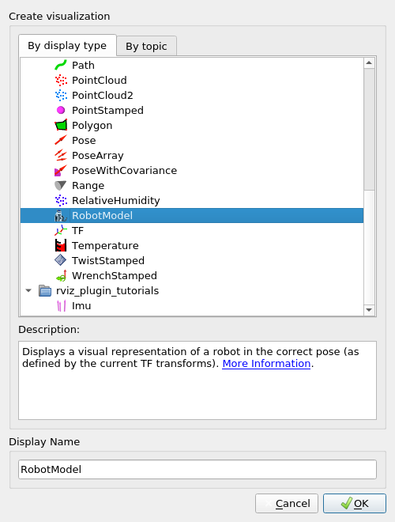

# Basic Robotics

Basic Robotics related software provided in ROS. This package includes a brief overview of facilities like visualization, robotic simulation and sensors that ROS provides. Essential softwares like `RViz`, `Gazebo` and frameworks like `MoveIt!` are explored here.

## Table of contents

- [Basic Robotics](#basic-robotics)
    - [Table of contents](#table-of-contents)
    - [Creating this package](#creating-this-package)
    - [Foreword](#foreword)
    - [Tutorials](#tutorials)
        - [Tutorial 0: Getting Started with RViz](#tutorial-0-getting-started-with-rviz)
        - [Tutorial 1: Visualizing data in RViz](#tutorial-1-visualizing-data-in-rviz)
        - [Tutorial 2: Building and visualizing robot models](#tutorial-2-building-and-visualizing-robot-models)
    - [Launch Files](#launch-files)
    - [C++ Nodes](#c-nodes)
        - [Laser Scan Publisher (C++) for Tutorial 1](#laser-scan-publisher-c-for-tutorial-1)
            - [Building](#building)
            - [Running](#running)
        - [TF Publisher (C++) for Tutorial 1](#tf-publisher-c-for-tutorial-1)
    - [Python Nodes](#python-nodes)
        - [Laser Scan Publisher (Python) for Tutorial 1](#laser-scan-publisher-python-for-tutorial-1)
            - [Building](#building-1)
            - [Running](#running-1)
    - [RViz configuration files](#rviz-configuration-files)
        - [LaserScan and TF for Tutorial 1](#laserscan-and-tf-for-tutorial-1)
    - [Reference](#reference)

## Creating this package

This package was created using the following commands

```bash
cd ~/ros_workspaces/learning_ws/src
catkin_create_pkg basic_robotics
```

The dependencies will be added later

## Foreword

As this package deals with more practical things, there is relatively less code in this and more of tutorial like exercises. When reading this file, you may either traverse from top to bottom (recommended for beginners) or navigate through [table of contents](#table-of-contents). If you are a beginner, it may be more beneficial to go through the [tutorials](#tutorials).

## Tutorials

Short tutorials included in this package made to cover essential concepts. They are as follows

| S. No. | Name | Notes |
| :--- | :--- | :--- |
| 1 | [Getting Started with RViz](#tutorial-0-getting-started-with-rviz) | Launching RViz and terminologies |
| 2 | [Visualizing data in RViz](#tutorial-1-visualizing-data-in-rviz) | Visualize `TF` and `LaserScan` using dummy publishers |
| 3 | [Building and Visualizing Robot Models](#tutorial-2-building-and-visualizing-robot-models) | Building a four wheel robot using `URDF` and `XACRO`, then visualizing it using `RobotModel` |

### Tutorial 0: Getting Started with RViz

RViz is essentially a node that was created to visualize different aspects of robotics. Things like visualizing sensor data (like a Lidar scan, point cloud, path, and even cameral feeds), robot data (like robot models and frame transformations). It is a node that has its GUI made using Qt.

In this tutorial, we will see how to launch it, learn about what is a configuration file and some basic terminologies.

> Rviz: A *visualization* tool in ROS

To start, first run `roscore` (as this is a node, it will require a running ROS Master). To start rviz, run

```bash
rosrun rviz rviz
```

Even simply `rviz` would run it (it is saved as an executable in `/opt/ros/noetic/bin`). After the GUI opens, you may something like this.


Whatever you see in the GUI is loaded by rviz using a *configuration file*. We shall later see how we can create our own configuration files that will help us set up things specific to visualization tasks. For now, see the definition.

> RViz configuration file: A YAML file that contains the type of things RViz should display.

You may see the default configuration file `/opt/ros/noetic/share/rviz/default.rviz` to understand the basic structure (but that won't be required as it is handled by rviz, we virtually never have to edit configuration files directly).

To see different things that Rviz can visualize, click on `Add` (right above `Time` in the bottom left). A menu like what's shown below shall open



This menu includes all the things that come with `rviz` to visualize. You can see the description of each item written under. You may even add a custom *Display Name* to show in the Displays panel (the left panel in RViz GUI). Information on all the built in display types can be found [here](https://wiki.ros.org/rviz/DisplayTypes). Try adding `RobotModel` as shown (click `OK`), you'll see that a new entry in `Displays` has appeared (for now, an error status may be being shown, that's not an issue: it's because we haven't yet created a robot model to visualize). The same will happen for each of the times in the above menu. For each item, there are configuration options, these too are configured as YAML values in the configuration file.

Most importantly, you may notice a topic to choose for many sensors (like `Camera` will have an `Image Topic`). This basically will link that topic: RViz will subscribe to that topic, receive data from publisher and show whatever it gets in the visualization form (an image stream for camera).

Now that we know what RViz is and basics of a configuration file, you may simply close the Rviz GUI window. Choose to close without saving the changes.

### Tutorial 1: Visualizing data in RViz

In this tutorial, we explore how to visualize data on a topic in RViz. For this particular example, we will visualize `TF` (frame transformations) and a `LaserScan`. In the real world, sensor data is directly published by sensors (using hardware plugins for ROS). It is also possible to fetch this data from a simulator like `Gazebo` (more on that later). Here, we will create a dummy node that will publish this data on a topic and then we will configure RViz to subscribe to these topics.

This tutorial uses the following resources of this package

| S. No. | File | Purpose | Notes |
| :--- | :--- | :---: | :---- |
| 1 | [LaserScan_TF_T1](#laserscan-and-tf-for-tutorial-1) | RViz configuration file | The configuration file consisting of `LaserScan` and `TF` display and an `Axes` |
| 2a | [t1_cpp_laser_scan_publisher](#laser-scan-publisher-c-for-tutorial-1) | C++ Publisher | Dummy publisher for `LaserScan` |
| 2b | [t1_laser_scan_publisher.py](#laser-scan-publisher-python-for-tutorial-1) | Python Publisher | Dummy publisher for `LaserScan` |
| 3 | []() | | |

### Tutorial 2: Building and visualizing robot models

## Launch Files

## C++ Nodes

Nodes written in C++ for this package.

### Laser Scan Publisher (C++) for Tutorial 1

| Field | Value |
| :---- | :---- |
| Name | `t1_cpp_laser_scan_publisher` |
| File | [src/t1_laser_scan_publisher.cpp](./src/t1_laser_scan_publisher.cpp) |

This node is a simple publisher that publishes messages of type `sensor_msgs/LaserScan`. It accepts the publishing topic name, frequency and frame from the parameter server (as local parameters) and publishes messages to topic `/t1_laser_scan` (by default). See the code for more information.

#### Building

In your `CMakeLists.txt` file, add

1. In the `find_package` function, add `std_msgs` and `sensor_msgs`. These are needed as dependencies for accessing built message headers. Your function `find_package` in `CMakeLists.txt` file must look somewhat like this

    ```txt
    find_package(catkin REQUIRED COMPONENTS
        roscpp
        std_msgs
        sensor_msgs
    )
    ```

    Notice the dependency on `roscpp` as well. This is how you can add dependencies to a catkin package that was initialized with no dependencies.

2. In the `catkin_package` function (under section `catkin specific configuration`), add the packages `roscpp`, `std_msgs` and `sensor_msgs` as `CATKIN_DEPENDS` because these packages will be needed by others who create projects dependent on our package. It is good to have them so that the dependency tree is created for catkin. The function must end up looking somewhat like this

    ```txt
    catkin_package(
    #  INCLUDE_DIRS include
    #  LIBRARIES basic_robotics
        CATKIN_DEPENDS roscpp std_msgs sensor_msgs
    #  DEPENDS system_lib
    )
    ```

3. Next, add the following lines in your `CMakeLists.txt` file to create the executable

    ```txt
    add_executable(t1_laser_scan_pub src/t1_laser_scan_publisher.cpp)
    target_link_libraries(t1_laser_scan_pub ${catkin_LIBRARIES})
    ```

In your `package.xml` file, add

1. `<build_depend>`, `<build_export_depend>` and `<exec_depend>` for each of `roscpp`, `std_msgs` and `sensor_msgs`. Basically add the following lines at appropriate places

    Add these right after `<buildtool_depend>` (catkin build tool)

    ```xml
    <build_depend>roscpp</build_depend>
    <build_depend>std_msgs</build_depend>
    <build_depend>sensor_msgs</build_depend>
    <build_export_depend>roscpp</build_export_depend>
    <build_export_depend>std_msgs</build_export_depend>
    <build_export_depend>sensor_msgs</build_export_depend>
    <exec_depend>roscpp</exec_depend>
    <exec_depend>std_msgs</exec_depend>
    <exec_depend>sensor_msgs</exec_depend>
    ```

Now, run `catkin_make` in the workspace directory

#### Running

This node will actually be run as a part of tutorial 1, but there are some important things you must infer from just this node.

Run `roscore` first. To run this node, run the command

```bash
rosrun basic_robotics t1_laser_scan_pub
```

You must now see `/t1_laser_scan` in `rostopic list`. Now run rviz using the following commands (the configuration file was made using [this](#laserscan-and-tf-for-tutorial-1))

```bash
roscd basic_robotics
rosrun rviz rviz -d ./rviz/LaserScan_TF_T1.rviz
```

Now, under `LaserScan` in `Displays`, choose the `Topic` to be `/t1_laser_scan`. You'll see the `Status` soon turn to `Error` with the message under `Transform`, as shown below


The error message basically means that RViz could not find transformation from `global` to `map`. This is because the `Fixed Frame` is set to `map`. Change it to `global` and you'll see the points correctly being rendered (you can change the display properties under `LaserScan` display item). It must look something like this


You may close the `RViz` GUI and save the configurations to the same file. More on this is described in the launch file and the tutorial description.

### TF Publisher (C++) for Tutorial 1

## Python Nodes

### Laser Scan Publisher (Python) for Tutorial 1

| Field | Value |
| :---- | :---- |
| Name | `t1_laser_scan_publisher.py` |
| File | [scripts/t1_laser_scan_publisher.py](./scripts/t1_laser_scan_publisher.py) |

This node is a simple publisher that publishes messages of type `sensor_msgs/LaserScan`. It accepts the publishing topic name, frequency and frame from the parameter server (as local parameters) and publishes messages to topic `/t1_laser_scan` (by default). See the code for more information.

#### Building

In your `CMakeLists.txt` file, add

1. In the `find_package` function, add `std_msgs` and `sensor_msgs`. These are needed as dependencies for accessing built message headers. Your function `find_package` in `CMakeLists.txt` file must look somewhat like this

    ```txt
    find_package(catkin REQUIRED COMPONENTS
        roscpp
        rospy
        std_msgs
        sensor_msgs
    )
    ```

    Notice the dependency on `rospy` as well. This is how you can add dependencies to a catkin package that was initialized with no dependencies. The `roscpp` dependency is not required if you do not have any `C++` nodes in your package.

2. In the `catkin_package` function (under section `catkin specific configuration`), add the packages `rospy`, `std_msgs` and `sensor_msgs` as `CATKIN_DEPENDS` because these packages will be needed by others who create projects dependent on our package. It is good to have them so that the dependency tree is created for catkin. The function must end up looking somewhat like this

    ```txt
    catkin_package(
    #  INCLUDE_DIRS include
    #  LIBRARIES basic_robotics
        CATKIN_DEPENDS roscpp rospy std_msgs sensor_msgs
    #  DEPENDS system_lib
    )
    ```

3. Next, add the following lines in your `CMakeLists.txt` file to create the executable

    ```txt
    catkin_install_python(PROGRAMS
        scripts/t1_laser_scan_publisher.py
        DESTINATION ${CATKIN_PACKAGE_BIN_DESTINATION}
    )
    ```

In your `package.xml` file, add

1. `<build_depend>`, `<build_export_depend>` and `<exec_depend>` for each of `rospy`, `std_msgs` and `sensor_msgs`. Basically add the following lines at appropriate places

    Add these right after `<buildtool_depend>` (catkin build tool)

    ```xml
    <buildtool_depend>catkin</buildtool_depend>
    <build_depend>roscpp</build_depend>
    <build_depend>rospy</build_depend>
    <build_depend>std_msgs</build_depend>
    <build_depend>sensor_msgs</build_depend>
    <build_export_depend>roscpp</build_export_depend>
    <build_export_depend>rospy</build_export_depend>
    <build_export_depend>std_msgs</build_export_depend>
    <build_export_depend>sensor_msgs</build_export_depend>
    <exec_depend>roscpp</exec_depend>
    <exec_depend>rospy</exec_depend>
    <exec_depend>std_msgs</exec_depend>
    <exec_depend>sensor_msgs</exec_depend>
    ```

    You do not need `roscpp` if you do not have `C++` nodes in your package.

Now, run `catkin_make` in the workspace directory

#### Running

This node will actually be run as a part of tutorial 1, but there are some important things you must infer from just this node.

Run `roscore` first. To run this node, run the command

```bash
rosrun basic_robotics t1_laser_scan_publisher.py
```

You must now see `/t1_laser_scan` in `rostopic list`. Now run rviz using the following commands (the configuration file was made using [this](#laserscan-and-tf-for-tutorial-1))

```bash
roscd basic_robotics
rosrun rviz rviz -d ./rviz/LaserScan_TF_T1.rviz
```

Now, under `LaserScan` in `Displays`, choose the `Topic` to be `/t1_laser_scan`. You'll see the `Status` soon turn to `Error` with the message under `Transform` (that is if you haven't applied any changes to the RViz configuration file), as shown below


The error message basically means that RViz could not find transformation from `global` to `map`. This is because the `Fixed Frame` is set to `map`. Change it to `global` and you'll see the points correctly being rendered (you can change the display properties under `LaserScan` display item). It must look something like this


You may close the `RViz` GUI and save the configurations to the same file. More on this is described in the launch file and the tutorial description.

## RViz configuration files

### LaserScan and TF for Tutorial 1

| Field | Value |
| :---- | :---- |
| Name | `LaserScan_TF_T1.rviz` |
| File | [rviz/LaserScan_TF_T1.rviz](./rviz/LaserScan_TF_T1.rviz) |

This file is made for Tutorial 1. It is to view a `LaserScan` and a `TF`. Here's how to create it

1. Run `roscore` and `rviz`.
2. Add an `Axes` on the frame. This will serve as a reference frame (to know where the X, Y and Z of the world frame are). Customize it to your liking.
3. Add a `LaserScan`. This will be used to display a 2D laser scan in the frame. For now, let the topic be empty.
4. Add a `TF`. This will enable us to visualize the transformation tree on a topic called `/tf`.
5. Save the configuration in the folder `rviz` inside the workspace (the file is linked above).
6. Close rviz and try running the following commands to test if everything is working

    ```bash
    roscd basic_robotics
    rviz -d ./rviz/LaserScan_TF_T1.rviz
    ```

    This would open `rviz` with the configuration that we saved. To know more about `-d` and other options, run `rviz --help`.

Hereon, only the things added will be briefly mentioned.

## Reference

- [RViz on roswiki](https://wiki.ros.org/rviz)
    - [User Guide](https://wiki.ros.org/rviz/UserGuide)
    - [Display Types](https://wiki.ros.org/rviz/DisplayTypes)
- [RViz introduction YouTube](https://www.youtube.com/watch?v=i--Sd4xH9ZE&feature=emb_logo)
