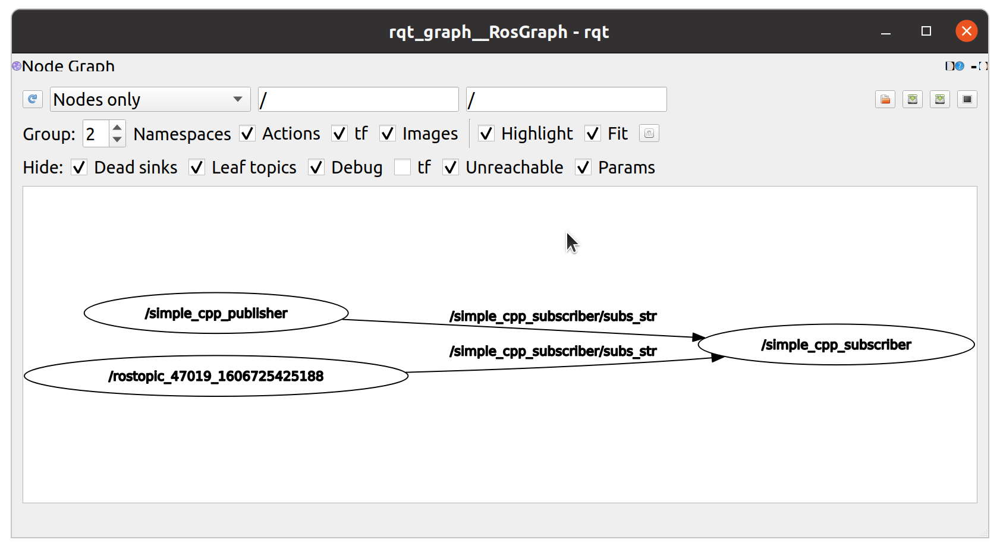

# Basic Nodes (C++)

Basic C++ Nodes to understand essential concepts and the build procedure for a C++ package.

> Link to the README of the `src` folder [here](../README.md)

## Table of contents

- [Basic Nodes (C++)](#basic-nodes-c)
    - [Table of contents](#table-of-contents)
    - [Creating this package](#creating-this-package)
    - [Foreword](#foreword)
    - [Nodes](#nodes)
        - [Simple Hello World](#simple-hello-world)
            - [Building a C++ Node](#building-a-c-node)
            - [Running the Node](#running-the-node)
        - [Simple Publisher](#simple-publisher)
            - [Building](#building)
            - [Running](#running)
        - [Simple Subscriber](#simple-subscriber)
            - [Building](#building-1)
            - [Running](#running-1)
        - [Simple Service Server](#simple-service-server)
            - [Building](#building-2)
            - [Running](#running-2)
    - [Services](#services)
        - [AddAllFloat64Numbers_cpp](#addallfloat64numbers_cpp)
            - [Building messages, services and messages](#building-messages-services-and-messages)
                - [Package.xml](#packagexml)
                - [CMakeLists.txt](#cmakeliststxt)
    - [Reference](#reference)

## Creating this package

This package was created using the following commands

```bash
cd ~/ros_workspaces/learning_ws/src
catkin_create_pkg cpp_basic_nodes roscpp
```

## Foreword

This is the first package and hence things are described in a little more detail here. The source code has comments describing the contents that are new.

When reading this file, you may either traverse from top to bottom (recommended for beginners) or navigate through [table of contents](#table-of-contents).

Make sure you know how to build a package before proceeding.

## Nodes

Nodes declared in this package

### Simple Hello World

| Field | Value |
| :-- | :--- |
| Node name | `simple_hello_world` |
| Code | [src/simple_hello_world.cpp](./src/simple_hello_world.cpp) |

Node prints `Hello, World!` and different levels of logging messages.

#### Building a C++ Node

To build the node, add the following in the `CMakeLists.txt` file in the package

1. Go to the `Build` section (it must be decorated with "Build" heading)
    1. Scroll to the `add_executable` function

        Add the following lines immediately after the comment block

        ```txt
        add_executable(simple_hello_world src/simple_hello_world.cpp)
        ```

        This will create an executable named `simple_hello_world` from the source code `simple_hello_world.cpp`.

        > More on `add_executable` in `CMakeLists.txt` [here](http://wiki.ros.org/catkin/CMakeLists.txt#Executable_Targets)
    2. Scroll to the `target_link_libraries` function

        Add the ROS libraries in this function. The executable may need function calls from the default libraries (it depends on these libraries). You can use the `${catkin_LIBRARIES}` variable to get the default libraries.

        ```txt
        target_link_libraries(simple_hello_world ${catkin_LIBRARIES})
        ```

        > More on `target_link_libraries` in `CMakeLists.txt` [here](http://wiki.ros.org/catkin/CMakeLists.txt#target_link_libraries)

After that, build the package by running `catkin_make` in the workspace directory. After a successful build process, you must see an executable named `simple_hello_world` in the directory `devel/lib/cpp_basic_nodes` (inside the workspace). This means that the workspace stores all the executables in the `devel` folder.

A similar procedure shall be followed for other nodes, so only the function names shall be mentioned hereon.

#### Running the Node

First, make sure that `roscore` is running and that the package has been built successfully and can be found using `rospack find`

```bash
rospack find cpp_basic_nodes
```

Should return the path to the package. To run the node, run

```bash
rosrun cpp_basic_nodes simple_hello_world
```

This should run the node. Inspect the output of the following

```bash
rosnode list
```

This shall show the node as `/hello_world_simple`, that is the name used in `ros::init` function in the source code. This means that the name of the node during runtime can be different from the name of the executable.

Hereon, only the `rosrun` command (the bare minimum) shall be described.

After that, try running the node as

```bash
rosrun cpp_basic_nodes simple_hello_world arg1 arg2 arg3
```

You may kill the node using

```bash
rosnode kill /hello_world_simple
```

After running the node, a few observations can be made:

- The debug messages do not appear, but information level and above messages do appear.
- Proper logging etiquette is observed. Do not use `cout` to log things.
- The first argument passed to any executable is the full path of the executable, followed by arguments passed during the call.
- The second debug message was visible (changed logger level in code).
- You have successfully run your first C++ ROS node.

### Simple Publisher

| Field | Value |
| :--- | :--- |
| Node name | `simple_cpp_publisher` |
| Code | [src/simple_publisher.cpp](./src/simple_publisher.cpp) |

Node publishes a message on a topic named `/simple_cpp_publisher/hello_str`. Demonstrates publishing messages on a topic and name scoping.

#### Building

In the `CMakeLists.txt`, add the following

```txt
add_executable(simple_cpp_publisher src/simple_publisher.cpp)
```

and

```txt
target_link_libraries(simple_cpp_publisher ${catkin_LIBRARIES})
```

Then, run `catkin_make` in the workspace folder.

#### Running

To run the node, first run `roscore`, then

```bash
rosrun cpp_basic_nodes simple_cpp_publisher
```

Now, run

```bash
rostopic list
```

You must see `/simple_cpp_publisher/hello_str` in the output. This is because the node handle was passed the `~` in the source code (namespace has become local to the node). If you rebuild the node after removing `~`, the name would then become `/hello_str` (that is, use `ros::NodeHandle nh;` instead of `ros::NodeHandle nh("~");`).

You can inspect the contents of the messages being published by running

```bash
rostopic echo /simple_cpp_publisher/hello_str
```

This would echo messages from the point where the command was called. You are encouraged to experiment and understand things before proceeding further (same is true for everything hereon).

Kill the nodes using `rosnode kill` commands.

### Simple Subscriber

| Field | Value |
| :--- | :--- |
| Node name | `simple_cpp_subscriber` |
| Code | [src/simple_subscriber.cpp](./src/simple_subscriber.cpp) |

Node subscribes to a topic named `/simple_cpp_subscriber/subs_str`. Demonstrates subscribing to messages received on a topic.

#### Building

In the `CMakeLists.txt`, add the following lines at appropriate places

```txt
add_executable(simple_cpp_subscriber src/simple_subscriber.cpp)
```

```txt
target_link_libraries(simple_cpp_subscriber ${catkin_LIBRARIES})
```

Then run `catkin_make` in the workspace folder.

#### Running

To run the node, first run `roscore`, then

```bash
rosrun cpp_basic_nodes simple_cpp_subscriber
```

Now, after running

```bash
rostopic list
```

You must see a topic named `/simple_cpp_subscriber/subs_str` has been created. Get more information about it using `rostopic info`.

To publish a message on that topic at a particular frequency, run

```bash
rostopic pub /simple_cpp_subscriber/subs_str std_msgs/String "data: 'Hello World'" -r 0.2
```

This would publish a message with data as `Hello World` every 5 seconds (0.2 Hz is the rate passed).

You may even experiment with remapping arguments to make the publisher that we had created earlier to publish messages to `/simple_cpp_subscriber/subs_str` instead of its default programmed publishing topic `/simple_cpp_publisher/hello_str`. To do that, run the following command

```bash
rosrun cpp_basic_nodes simple_cpp_publisher /simple_cpp_publisher/hello_str:=/simple_cpp_subscriber/subs_str
```

Remember that the publisher actually publishes at a programmed rate of 0.5 Hz. If you have the previous `rostopic pub` node still running, there actually are two nodes publishing and one node subscribing to the topic. Run the following command

```bash
rosrun rqt_graph rqt_graph
```

Would produce the following output



You may further experiment with the code to see how the output changes. Most notably, you can do the following

1. Try creating a large enough delay in the subscriber callback that messages accumulate. Then see what happens. More about a standard way of creating a delay on the current thread [here](http://www.cplusplus.com/reference/thread/this_thread/sleep_for/). You can further experiment here with different queue sizes.

### Simple Service Server

| Field | Value |
| :--- | :--- |
| Node name | `simple_cpp_service_server` |
| Code | [src/simple_service_server.cpp](./src/simple_service_server.cpp) |
| Service | [AddAllFloat64Numbers_cpp.srv](./srv/AddAllFloat64Numbers_cpp.srv) |

Before this node, you have to understand declaring and building services. Check [AddAllFloat64Numbers_cpp section](#addallfloat64numbers_cpp) for that. This node demonstrates how to create a service server.

#### Building

In the `CMakeLists.txt`, add the following lines at appropriate places

1. Add the `add_executable` function

    ```txt
    add_executable(simple_cpp_service_server src/simple_service_server.cpp)
    ```

2. Add the `add_dependencies` function

    ```txt
    add_dependencies(simple_cpp_service_server ${${PROJECT_NAME}_EXPORTED_TARGETS} ${catkin_EXPORTED_TARGETS})
    ```

    Notice the `${${PROJECT_NAME}_EXPORTED_TARGETS}` dependency, which is required for the dependency on the package messages, services and actions declared. This means that you actually do not even need to build those messages before you use them in the nodes of the same package. The dependency order will be automatically set to build messages and underlying headers before using them to build the nodes.

    > Check out [this example](http://wiki.ros.org/catkin/CMakeLists.txt#Example) on roswiki for more

3. Add the `target_link_libraries` function

    ```txt
    target_link_libraries(simple_cpp_service_server ${catkin_LIBRARIES})
    ```

Then run `catkin_make` in the workspace folder.

#### Running

To run this node, run `roscore` first. To run the node, run

```bash
rosrun cpp_basic_nodes simple_cpp_service_server
```

After this, the `rosservice` tool can be used to find if the service is running

```bash
rosservice list
```

To call the service, a service client could be used or the call can also be made through the command line. Try running

```bash
rosservice call /simple_cpp_service_server/add_numbers "data:
- 12.5
- 37.25
- 100.75
- -20.3"
```

When you used tab completion, the first data value would be filled with 0. Just remove the ending `"` and continue on by typing an enter (or even `Ctrl-V Ctrl-J` would do). Usually after pressing enter, another prompt shows up to indicate completing the string, that is stored in `$PS2` (usually a `>`). After pressing enter upon completing the string with `"`, an output like this must appear

```txt
sum: 130.2
```

## Services

Services declared in this package

### AddAllFloat64Numbers_cpp

| Field | Value |
| :---- | :---- |
| Name | `AddAllFloat64Numbers_cpp` |
| File | [srv/AddAllFloat64Numbers_cpp.srv](./srv/AddAllFloat64Numbers_cpp.srv) |
| Service Request | `float64[] data` |
| Service Response | `float64 sum` |

A service that adds all the numbers sent in the _request_ and sends the result as a _response_.

#### Building messages, services and messages

The file description is actually just created a service description file. We need to build the files (header and source files) so that this and other packages can use this service.

##### Package.xml

To do that, open `package.xml` file and add the following lines at appropriate places:

1. Add a `build_depend` to `message_generation`. This will allow building messages, services and actions at compile time.

    Go to the part where `<build_depend>` tags are located and add the following tags to the list

    ```xml
    <build_depend>message_generation</build_depend>
    <build_depend>std_msgs</build_depend>
    ```

    This would tell that the package depends on `message_generation` package for building. The package `message_generation` is used for building the messages, services and actions. The second package, `std_msgs`, is needed for the messages.
2. Add an `exec_depend` to `message_runtime`.

    Go to the part where `<exec_depend>` tags are located and add the following tag to the list

    ```xml
    <exec_depend>message_runtime</exec_depend>
    <exec_depend>std_msgs</exec_depend>
    ```

    This is used to tell that we need the `message_runtime` package at runtime. The second package, `std_msgs`, is needed for the messages.

##### CMakeLists.txt

As the `package.xml` file is [just a manifesto file](http://wiki.ros.org/catkin/package.xml), we need to make the following changes to the `CMakeLists.txt` file (as that is the file which is [used to actually build the package](http://wiki.ros.org/catkin/CMakeLists.txt))

1. In the `find_package` function, add `message_generation` to `catkin REQUIRED COMPONENTS` in a new line (after the end of already declared packages)

    After adding `message_generation` (and adding `std_msgs` for standard messages), the function must look somewhat like this

    ```txt
    find_package(catkin REQUIRED COMPONENTS
      roscpp
      message_generation
      std_msgs
    )
    ```

    > More about the `find_package` function [here](http://wiki.ros.org/catkin/CMakeLists.txt#Finding_Dependent_CMake_Packages)

2. Under `catkin specific configuration` heading (just before the `Build` heading), add `message_runtime` as `CATKIN_DEPENDS`.

    After adding `message_runtime` (and `std_msgs` for standard messages), the function must look somewhat like this

    ```txt
    catkin_package(
    #  INCLUDE_DIRS include
    #  LIBRARIES cpp_basic_nodes
    CATKIN_DEPENDS roscpp message_runtime std_msgs
    #  DEPENDS system_lib
    )
    ```

    > More about the `catkin_package` function [here](http://wiki.ros.org/catkin/CMakeLists.txt#catkin_package.28.29)

3. Go to the `Declare ROS messages, services and actions` heading. You shall also find the whole procedure as comments in this section.
    1. Add the `add_action_files` (you could uncomment the existing code, or write a new one under it).

        Include the `.srv` files declared in the `srv` folder here. After adding the function, it would look like this

        ```txt
        add_service_files(
            FILES
            AddAllFloat64Numbers_cpp.srv
        )
        ```

    2. Add the `generate_messages` function to the macro. This is to invoke code generation for the source code.

        Add the `std_msgs` dependency. After everything, the function must look like this

        ```txt
        generate_messages(
            DEPENDENCIES
            std_msgs    # Float64
        )
        ```

    > There is an [example on roswiki](http://wiki.ros.org/catkin/CMakeLists.txt#Example) to demonstrate changes to the CMakeLists.txt file for adding custom messages, services and actions

After all this, run the `catkin_make` command in the workspace directory. You must see the header files for C++ nodes in the `devel/include/cpp_basic_nodes` directory of the workspace. The main header file, request file and response file are present here. Everything is stored in a namespace bearing the same name as the package name (that is `cpp_basic_nodes`).

For python, the library source files are present in the `devel/lib/python3/dist-packages/cpp_basic_nodes` directory (inside the workspace directory).

For any IDE, you may want to include the `devel/include` directory (for auto completion features).

## Reference

- roswiki
    - [Remapping Arguments](http://wiki.ros.org/Remapping%20Arguments)
