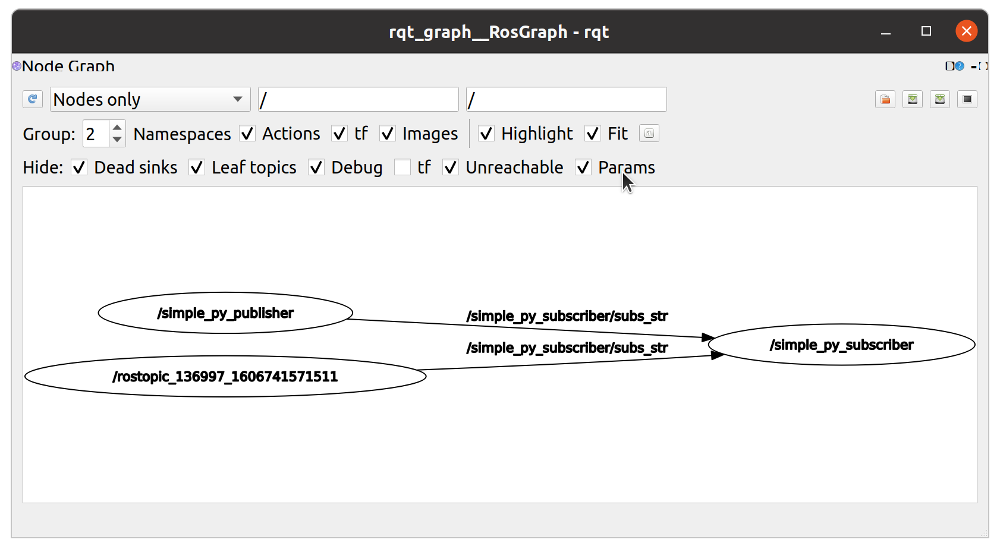
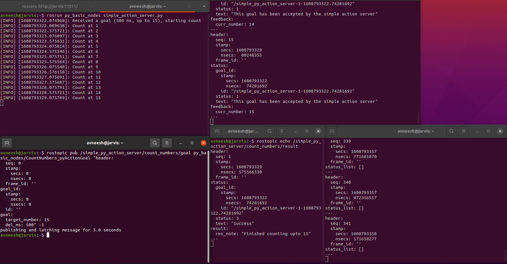
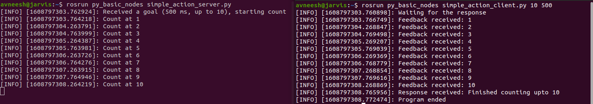
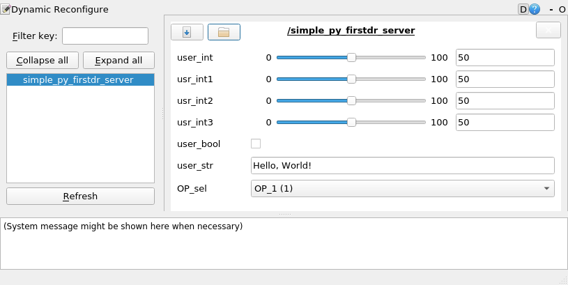
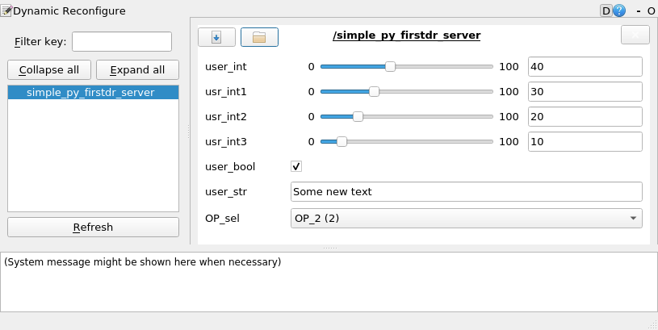
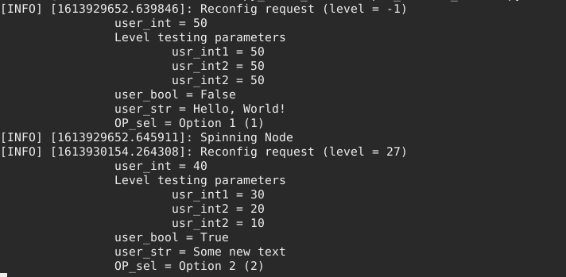

# Basic Nodes (Python)

Basic Python Nodes to understand essential concepts and the build procedure for a python package.

> Link to the README of the `src` folder [here](../README.md)

## Table of contents

- [Basic Nodes (Python)](#basic-nodes-python)
    - [Table of contents](#table-of-contents)
    - [Creating this package](#creating-this-package)
    - [Foreword](#foreword)
    - [Contents](#contents)
    - [Nodes](#nodes)
        - [Simple Hello World](#simple-hello-world)
            - [Creating executable](#creating-executable)
            - [Running a python node](#running-a-python-node)
        - [Simple Publisher](#simple-publisher)
            - [Building](#building)
            - [Running](#running)
        - [Simple Subscriber](#simple-subscriber)
            - [Building](#building-1)
            - [Running](#running-1)
        - [Simple Service Server](#simple-service-server)
            - [Building](#building-2)
            - [Running](#running-2)
        - [Simple Service Client](#simple-service-client)
            - [Building](#building-3)
            - [Running](#running-3)
        - [Simple Action Server](#simple-action-server)
            - [Building](#building-4)
            - [Running](#running-4)
        - [Simple Action Client](#simple-action-client)
            - [Building](#building-5)
            - [Running](#running-5)
        - [Simple Parameter Node](#simple-parameter-node)
            - [Building](#building-6)
            - [Running](#running-6)
        - [Launch1 Publisher](#launch1-publisher)
            - [Building](#building-7)
        - [Launch1 Subscriber](#launch1-subscriber)
            - [Building](#building-8)
        - [Launch1 Parameters](#launch1-parameters)
            - [Building](#building-9)
        - [Simple Dynamic Reconfiguration Server](#simple-dynamic-reconfiguration-server)
            - [Building](#building-10)
            - [Running](#running-7)
    - [Services](#services)
        - [AddAllFloat64Numbers_py](#addallfloat64numbers_py)
            - [Building services and messages](#building-services-and-messages)
                - [Package.xml](#packagexml)
                - [CMakeLists.txt](#cmakeliststxt)
    - [Actions](#actions)
        - [CountNumbers_py](#countnumbers_py)
            - [Building actions](#building-actions)
                - [Package.xml](#packagexml-1)
                - [CMakeLists.txt](#cmakeliststxt-1)
    - [YAML Files](#yaml-files)
        - [Params1](#params1)
            - [Loading parameters](#loading-parameters)
        - [l1_params1](#l1_params1)
        - [l1_params2](#l1_params2)
    - [Launch Files](#launch-files)
        - [Launch1](#launch1)
    - [Dynamic Reconfiguration Files](#dynamic-reconfiguration-files)
        - [FirstDR](#firstdr)
            - [Building Dynamic Reconfiguration Files](#building-dynamic-reconfiguration-files)
    - [Reference](#reference)

## Creating this package

This package was creates using the following commands

```bash
cd ~/ros_workspaces/learning_ws/src
catkin_create_pkg py_basic_nodes rospy
```

## Foreword

This is teh first package and hence things are described in a little more detail here. The source code has comments describing the contents that are new.

When reading this file, you may either traverse from top to bottom (recommended for beginners) or navigate through [table of contents](#table-of-contents). If you are a beginner, you're suggested to navigate the package using the [contents](#contents) section. In the [Nodes](#nodes) section, the nodes are described starting with a table (to lead you to the source code). Same is done for other sections hereon.

Make sure you know how to build a package before proceeding.

## Contents

Suggested order of traversal for the items in this package (specially for beginners)

| S. No. | Name | Link | Description |
| :---- | :---: | :--- | :---- |
| 1 | Hello World | [Nodes > Simple Hello World](#simple-hello-world) | Prints `Hello, World!` |
| 2 | Publisher (Simple) | [Nodes > Simple Publisher](#simple-publisher) | Publish messages |
| 3 | Subscriber (Simple) | [Nodes > Simple Subscriber](#simple-subscriber) | Subscribe to messages |
| 4 | Creating AddAllFloat64Numbers_py service | [Services > AddAllFloat64Numbers_py](#addallfloat64numbers_py) | Creating and building your own service (.srv file) |
| 5 | Service Server (Simple) | [Nodes > Simple Service Server](#simple-service-server) | Server for the service AddAllFloat64Numbers_py |
| 6 | Service Client (Simple) | [Nodes > Simple Service Client](#simple-service-client) | Client for the service AddAllFloat64Numbers_py |
| 7 | Creating CountNumbers_py action | [Actions > CountNumbers_py](#countnumbers_py) | Creating and building your own action (`.action` file) |
| 8 | Action Server (Simple) | [Nodes > Simple Action Server](#simple-action-server) | Server for the action CountNumbers_py |
| 9 | Action Client (Simple) | [Nodes > Simple Action Client](#simple-action-client) | Client for the action CountNumbers_py |
| 10 | YAML ROS Parameter | [YAML Files > Params1](#params1) | Simple YAML file which can be loaded on the ROS Parameter Server (`.yaml` file) |
| 11 | Parameter Node (Simple) | [Nodes > Simple Parameter Node](#simple-parameter-node) | Accessing parameters on the parameter server |
| 12 | Publisher for `Launch1` | [Nodes > Launch1 Publisher](#launch1-publisher) | A publisher created for a launch file |
| 13 | Subscriber for `Launch1` | [Nodes > Launch1 Subscriber](#launch1-subscriber) | A subscriber created for a launch file |
| 14 | Parameters Node for `Launch1` | [Nodes > Launch1 Parameters](#launch1-parameters) | Accessing parameters, spawned through a launch file |
| 15 | YAML file 1 for `Launch1` | [YAML Files > l1_params1](#l1_params1) | A YAML file to load parameters into a launch file |
| 16 | YAML file 2 for `Launch1` | [YAML Files > l1_params2](#l1_params2) | A YAML file to load parameters into a launch file |
| 17 | `Launch1` launch file | [Launch Files > Launch1](#launch1) | A `.launch` file to simplify launching everything tagged as `Launch1` |

## Nodes

Nodes declared in this package

### Simple Hello World

| Field | Value |
| :--- | :---- |
| Node name | `simple_hello_world_py` |
| Code | [scripts/simple_hello_world.py](./scripts/simple_hello_world.py) |

Node prints `Hello, World!` and different levels of logging messages.

#### Creating executable

To create an executable, add the following to the `CMakeLists.txt` file

1. Go to the `Install` section (it must be decorated with "Install" heading)
    1. Scroll to the `catkin_install_python` function

        Add the following line immediately after the comment block

        ```txt
        catkin_install_python(PROGRAMS
            scripts/simple_hello_world.py
            DESTINATION ${CATKIN_PACKAGE_BIN_DESTINATION}
        )
        ```

        This is necessary to create an executable file for your python script.

        > More about the `catkin_install_python` function in `CMakeLists.txt` [here](http://wiki.ros.org/catkin/CMakeLists.txt#Installing_Python_Executable_Scripts) and in [catkin manual](http://docs.ros.org/en/api/catkin/html/howto/format2/installing_python.html)

After that, build the package by running `catkin_make` in the workspace directory. After a successful build process, you must see and executable named `simple_hello_world.py` in the directory `devel/lib/py_basic_nodes` (inside the workspace). This means that the workspace stores all the executables in the `devel` folder.

A similar procedure shall be followed for other nodes, so only the function names shall be mentioned hereon.

#### Running a python node

First, make sure that `roscore` is running. To run this node, run

```bash
rosrun py_basic_nodes simple_hello_world.py
```

You can even locate this package by running

```bash
rospack find py_basic_nodes
```

After inspecting the output of the following

```bash
rosnode list
```

One can say that the name of the node is what's mentioned in the `rospy.init_node` function.

Hereon, only the `rosrun` command (the bare minimum) shall be described.

After that, try running the node as

```bash
rosrun py_basic_nodes simple_hello_world.py arg1 arg2 arg3
```

You may kill the node using

```bash
rosnode kill /hello_world_simple_py
```

After running the node, a few observations can be made:

- You have successfully run your first Python ROS node.
- The first argument passed to any executable is the full path of the executable, followed by arguments passed during the call.
- Proper logging etiquette is observed. Do not use `print` to log things.

### Simple Publisher

| Field | Value |
| :--- | :---- |
| Node name | `simple_publisher.py` |
| Code | [scripts/simple_publisher.py](./scripts/simple_publisher.py) |

Node publishes a message on a topic named `/simple_py_publisher/hello_str`. Demonstrates publishing messages on a topic, name scoping and rate control.

#### Building

In the `CMakeLists.txt`, add the following to the `catkin_install_python` function

```bash
    scripts/simple_publisher.py
```

before the `DESTINATION ${CATKIN_PACKAGE_BIN_DESTINATION}`. Then run `catkin_make` in the workspace folder.

#### Running

To run the node, run `roscore` first, then

```bash
rosrun py_basic_nodes simple_publisher.py
```

Now, run

```bash
rostopic list
```

You must see `/simple_py_publisher/hello_str` in the list. This is because the node was named as such in the `Publisher` initialization call. If you change `"{0}/hello_str".format(rospy.get_name())` to `hello_str`, the output would have `/hello_str` instead.

You can inspect the contents of the messages being published by running

```bash
rostopic echo /simple_py_publisher/hello_str
```

This would echo messages from the point where the command was called. You are encouraged to experiment and understand things before proceeding further (same is true for everything hereon).

Kill the nodes using `rosnode kill` commands.

### Simple Subscriber

| Field | Value |
| :--- | :---- |
| Node name | `simple_py_subscriber` |
| Code | [scripts/simple_subscriber.py](./scripts/simple_subscriber.py) |

Node subscribes to topic named `/simple_py_subscriber/subs_str`. Demonstrates subscribing to messages received on a topic.

#### Building

In the `CMakeLists.txt`, add the following in the `catkin_install_python` function

```txt
    scripts/simple_subscriber.py
```

before the `DESTINATION ${CATKIN_PACKAGE_BIN_DESTINATION}`. Then run `catkin_make` in the workspace folder.

#### Running

To run the node, first run `roscore`, then

```bash
rosrun py_basic_nodes simple_subscriber.py
```

Now, after running

```bash
rostopic list
```

You must see a topic named `/simple_py_subscriber/subs_str` has been created. Get more information about it using `rostopic info`.

To publish a message on that topic at a particular frequency, run

```bash
rostopic pub /simple_py_subscriber/subs_str std_msgs/String "data: 'Hello World'" -r 0.2
```

This would publish a message with data as `Hello World` every 5 seconds (0.2 Hz is the rate passed).

You may even experiment with remapping arguments to make the publisher that we had created earlier to publish messages to `/simple_py_subscriber/subs_str` instead of its default programmed publishing topic `/simple_py_publisher/hello_str`. To do that, run the following command

```bash
rosrun py_basic_nodes simple_publisher.py /simple_py_publisher/hello_str:=/simple_py_subscriber/subs_str
```

Remember that the publisher actually publishes at a programmed rate of 0.5 Hz. If you have the previous `rostopic pub` node still running, there actually are two nodes publishing and one node subscribing to the topic. Run the following command

```bash
rosrun rqt_graph rqt_graph
```

Would produce the following output



You may further experiment with the code to see how the output changes. Most notably, you can do the following

1. Try creating a large enough delay in the subscriber callback that messages accumulate. Then see what happens. More about creating a delay in Python [here](https://realpython.com/python-sleep/#adding-a-python-sleep-call-with-timesleep). You can further experiment here with different queue sizes.

### Simple Service Server

| Field | Value |
| :--- | :---- |
| Node name | `simple_py_service_server` |
| Code | [scripts/simple_service_server.py](./scripts/simple_service_server.py) |
| Service | [AddAllFloat64Numbers_py.srv](./srv/AddAllFloat64Numbers_py.srv) |

Before this node, you have to understand declaring and building services. Check [AddAllFloat64Numbers_py](#addallfloat64numbers_py) for that. This node demonstrates how to create a service server.

#### Building

In the `CMakeLists.txt`, add the following lines at appropriate places

1. Add the script to `catkin_install_python` function

    Add the line

    ```txt
        scripts/simple_service_server.py
    ```

    before the `DESTINATION ${CATKIN_PACKAGE_BIN_DESTINATION}` line.

Then, run `catkin_make` in the workspace folder.

#### Running

To run this node, run `roscore` first. To run the node, run

```bash
rosrun py_basic_nodes simple_service_server.py
```

After this, the `rosservice` tool can be used to find if the service is running

```bash
rosservice list
```

To call the service, a service client could be used or the call can also be made through the command line. Try running

```bash
rosservice call /simple_py_service_server/add_numbers "data:
- 12.5
- 37.25
- 100.75
- -20.3"
```

When you used tab completion, the first data value would be filled with 0. Just remove the ending `"` and continue on by typing an enter (or even `Ctrl-V Ctrl-J` would do). Usually after pressing enter, another prompt shows up to indicate completing the string, that is stored in `$PS2` environment variable (usually a `>`). After pressing enter upon completing the string with `"`, an output like this must appear

```txt
sum: 130.2
```

### Simple Service Client

| Field | Value |
| :--- | :---- |
| Node name | `simple_py_service_client` |
| Code | [scripts/simple_service_client.py](./scripts/simple_service_client.py) |
| Service | [AddAllFloat64Numbers_py.srv](./srv/AddAllFloat64Numbers_py.srv) |

Before this node, you have to understand declaring and building services. Check [AddAllFloat64Numbers_py](#addallfloat64numbers_py) for that. This node demonstrates how to create a service client. It will call a service, so the service server needs to be present first. A simple service server is [demonstrated above](#simple-service-server).

#### Building

In the `CMakeLists.txt`, add the following lines at appropriate places

1. Add the script to `catkin_install_python` function

    Add the line

    ```txt
        scripts/simple_service_client.py
    ```

    before the `DESTINATION ${CATKIN_PACKAGE_BIN_DESTINATION}` line.

Then, run `catkin_make` in the workspace folder.

#### Running

To run this node, run `roscore` first. To use this node, a service server (servicing the service mentioned in the node, that is bearing the name `/simple_py_service_server/add_numbers`) must be running. This package has the [corresponding service server node](#simple-service-server). To run that node, run

```bash
rosrun py_basic_nodes simple_service_server.py
```

Ensure that the service `/simple_py_service_server/add_numbers` is running (using `rosservice list`)

To run this node, run a command like what's shown below (you can use any numbers in the argument)

```bash
rosrun py_basic_nodes simple_service_client.py 60 4 0.5 -98.7
```

If everything's gone right, the sum must return `-34.2` for the given numbers.

### Simple Action Server

| Field | Value |
| :--- | :---- |
| Node name | `simple_py_action_server` |
| Code | [scripts/simple_action_server.py](./scripts/simple_action_server.py) |
| Action | [action/CountNumbers_py.action](./action/CountNumbers_py.action) |

Before this node, you have to understand how `.action` files are build, check [Actions > CountNumbers_py](#countnumbers_py) for that. This node shows how to create an action server.

#### Building

In the `CMakeLists.txt` file, add the following line in `catkin_install_python` function before the `DESTINATION` line

```txt
    scripts/simple_action_server.py
```

Then, run `catkin_make` in the workspace

#### Running

To run this node, run `roscore` first. To run the node, run

```bash
rosrun py_basic_nodes simple_action_server.py
```

Note that actions actually use messages to communicate. To see the messages for the action, run the following command

```bash
rostopic list | grep /simple_py_action_server/count_numbers/
```

You'll see messages for `cancel`, `feedback`, `goal`, `result` and `status`. To test and see how the `actionlib` mechanism may work, run these commands in separate terminals that you can see at the same time

```bash
rostopic echo /simple_py_action_server/count_numbers/result
rostopic echo /simple_py_action_server/count_numbers/feedback
rostopic echo /simple_py_action_server/count_numbers/status
```

Then, in another terminal, we will publish a message to the `goal` topic. You could use the command below

```bash
rostopic pub /simple_py_action_server/count_numbers/goal py_basic_nodes/CountNumbers_pyActionGoal "header:
  seq: 0
  stamp:
    secs: 0
    nsecs: 0
  frame_id: ''
goal_id:
  stamp:
    secs: 0
    nsecs: 0
  id: ''
goal:
  target_number: 15
  del_ms: 500" -1
```

The above command will tell the server to count up to `15` with a delay of `500 ms` between each count. After everything is done, the output must look somewhat like below



The `status` is being displayed on the bottom right, with the `feedback` on top and `result` left to it. The main node is at the top left and under it is the publisher to `goal`.

As seen in the code, we have only programmed the logic of execution, and everything on the communication side has been handled by the `actionlib` package (which is why we needed it as a dependency). However, the method that we used here is not a proper one used to *call* actions (notice that we did not fill many fields in the `goal` publisher command above, namely header and goal ID). For that, we need to create an action client. Then, `actionlib` would handle the publishing part as well, we'd only have to give it the `goal`.

### Simple Action Client

| Field | Value |
| :--- | :--- |
| Name | `simple_py_action_client` |
| Code | [scripts/simple_action_client.py](./scripts/simple_action_client.py) |
| Action | [action/CountNumbers_py.action](./action/CountNumbers_py.action) |

Before this node, you have to understand how `.action` files are build, check [Actions > CountNumbers_py](#countnumbers_py) for that. This node shows how to create an action client. A [simple action server](#simple-action-server) that can be used with this client is demonstrated above.

#### Building

In the `CMakeLists.txt` file, add the following line in `catkin_install_python` function before the `DESTINATION` line

```txt
    scripts/simple_action_client.py
```

Then, run `catkin_make` in the workspace folder

#### Running

To run this node, run `roscore` first. In order to run an action client, an action server has to be spawned first, run the following

```bash
rosrun py_basic_nodes simple_action_server.py
```

Now, you can run the client using (run this on a different terminal window)

```bash
rosrun py_basic_nodes simple_action_client.py 10 500
```

This must produce the following output



You are encouraged to inspect the contents of the underlying messages as discussed in the [simple action server](#simple-action-server).

### Simple Parameter Node

| Field | Value |
| :--- | :---- |
| Name | `simple_py_parameter_node` |
| Code | [scripts/simple_parameter_server.py](./scripts/simple_parameter_server.py) |

Before this, it is suggested that you get a hands on experience with parameters. You must also understand the notion of storing and loading parameters through YAML files. Check out [YAML Files > Params](#params1) for understanding YAML files and parameter server in ROS.

#### Building

In the `CMakeLists.txt` file, add the following line in `catkin_install_python` function before the `DESTINATION` line

```txt
    scripts/simple_parameter_server.py
```

Then, run `catkin_make` in the workspace folder

#### Running

First, run `roscore`, then run this node using

```bash
rosrun py_basic_nodes simple_parameter_server.py
```

The output must consist of the contents of existing parameters (some keys/parameters may not be found and that's okay, you can `roskill` the node now). It must also have created another parameter on the server by the name of `/custom_py_parameter`, check it using `rosparam get` (this will persist even after the node as the resource is on the ROS Master). You must now load the [Params1.yaml](./yaml/Params1.yaml) file into the parameter server and then rerun the node.

```bash
rosparam load `rospack find py_basic_nodes`/yaml/Params1.yaml
rosrun py_basic_nodes simple_parameter_server.py
```

Now, the node must display the values of the parameters on the parameter server having previously unidentified keys. Most importantly, a junk parameter with the key `junk_parameter` must have been loaded by the YAML file (through `rosparam load` command) and then deleted by this node (check using `rosparam list` before running the node and after running the node, with the YAML file freshly loaded this time).

### Launch1 Publisher

| Field | Value |
| :--- | :---- |
| Node name | `launch1_publisher` |
| Code | [scripts/launch1_publisher.py](./scripts/launch1_publisher.py) |
| Launch File | [launch/launch1.launch](./launch/launch1.launch) |

A publisher made for the purpose of [Launch1](#launch1) file. Simply publishes messages to the topic `pub_topic`. Also uses a local parameter called `~/l1pub_PubFreq` to set the frequency of publishing (see code for more information).

#### Building

In the `CMakeLists.txt` file, add the following line in `catkin_install_python` function before the `DESTINATION` line

```txt
    scripts/launch1_publisher.py
```

Then, run `catkin_make` in the workspace folder. This node, along with some others, is supposed to be run in the `launch1.launch` process (check it out [here](#launch1)).

### Launch1 Subscriber

| Field | Value |
| :--- | :---- |
| Node name | `launch1_subscriber` |
| Code | [scripts/launch1_subscriber.py](./scripts/launch1_subscriber.py) |
| Launch File | [launch/launch1.launch](./launch/launch1.launch) |

A subscriber made for the purpose of [Launch1](#launch1) file. Simply subscribes to messages on topic `subs_topic` (see code for more information).

#### Building

In the `CMakeLists.txt` file, add the following line in `catkin_install_python` function before the `DESTINATION` line

```txt
    scripts/launch1_subscriber.py
```

Then, run `catkin_make` in the workspace folder. This node, along with some others, is supposed to be run in the `launch1.launch` process (check it out [here](#launch1)).

### Launch1 Parameters

| Field | Value |
| :---- | :---- |
| Name | `launch1_params` |
| Code | [scripts/launch1_parameters.py](./scripts/launch1_parameters.py) |
| Launch File | [launch/launch1.launch](./launch/launch1.launch) |

A node made to print out all parameter keys. It is suggested that you see [l1_params1](#l1_params1) and [l1_params2](#l1_params2) `.yaml` parameter files.

#### Building

In the `CMakeLists.txt` file, add the following line in `catkin_install_python` function before the `DESTINATION` line

```txt
    scripts/launch1_parameters.py
```

Then, run `catkin_make` in the workspace folder. This node, along with some others, is supposed to be run in the `launch1.launch` process (check it out [here](#launch1)).

### Simple Dynamic Reconfiguration Server

| Field | Value |
| :---- | :---- |
| Name | `simple_py_firstdr_server` |
| File | [scripts/simple_FirstDR_server.py](./scripts/simple_FirstDR_server.py) |
| Dynamic Reconfiguration File | [cfg/FirstDR.cfg](./cfg/FirstDR.cfg) |

A dynamic reconfiguration server made to host the parameters included in the `.cfg` file. This node depends on the [dynamic reconfiguration file](#firstdr). A server maintains the record of parameters and provides a callback interface for handling updates (these updates are made by a client).

#### Building

In the `CMakeLists.txt` file, add the following line in `catkin_install_python` function before the `DESTINATION` line

```txt
    scripts/simple_FirstDR_server.py
```

Then, run `catkin_make` in the workspace folder.

#### Running

First, run `roscore`, then run this node using

```bash
rosrun py_basic_nodes simple_FirstDR_server.py
```

The output will consist of the default parameters being loaded in the callback (with level being `-1` as no signal was called). The node then goes into spinning mode.

To call the callback, you'll need a client. You could create a node for that, however a simple GUI client is available using `rqt_reconfigure`. To run it, run

```bash
rosrun rqt_reconfigure rqt_reconfigure
```

This should open a GUI window like whats shown below



You can modify the values and see the output in the terminal running the node. You can also save the modified parameters as a `.yaml` file and restore them. This shall also allow testing how multiple parameters can be changed in just one attempt.

For example, for the following `rqt_reconfigure` configurations



The result is the following



Notice the level passed, it is the `binary OR` of all the parameters with a different value. You may also verify that the parameters are actual parameters on the ROS Parameter Server by inspecting the output of `rosparam list`. You may also what to check the `/simple_py_firstdr_server/set_parameters` service.

## Services

Services declared in this package

### AddAllFloat64Numbers_py

| Field | Value |
| :---- | :---- |
| Name | `AddAllFloat64Numbers_py` |
| File | [srv/AddAllFloat64Numbers_py.srv](./srv/AddAllFloat64Numbers_py.srv) |
| Service Request | `float64[] data` |
| Service Response | `float64 sum` |

A service that adds all the numbers sent in the _request_ and sends the result as a _response_. For example, if we send `1, -2.3, 56, -4` in request, it will send `50.7` (their sum) in response. However, note that the logic is not in the `.srv` file, but in the service server. This file only describes the structure.

#### Building services and messages

The file description is actually just created a service description file. We need to build the files (header and source files) so that this and other packages can use this service.

##### Package.xml

To do that, open `package.xml` file and add the following lines at appropriate places:

1. Add a `build_depend` to `message_generation`. This will allow building messages, services and actions at compile time.

    Go to the part where `<build_depend>` tags are located and add the following tags to the list

    ```xml
    <build_depend>message_generation</build_depend>
    <build_depend>std_msgs</build_depend>
    ```

    This would tell that the package depends on `message_generation` package for building. The package `message_generation` is used for building the messages, services and actions. The second package, `std_msgs`, is needed for the messages.
2. Add an `exec_depend` to `message_runtime`.

    Go to the part where `<exec_depend>` tags are located and add the following tag to the list

    ```xml
    <exec_depend>message_runtime</exec_depend>
    <exec_depend>std_msgs</exec_depend>
    ```

    This is used to tell that we need the `message_runtime` package at runtime. The second package, `std_msgs`, is needed for the messages.

##### CMakeLists.txt

As the `package.xml` file is [just a manifesto file](http://wiki.ros.org/catkin/package.xml), we need to make the following changes to the `CMakeLists.txt` file (as that is the file which is [used to actually build the package](http://wiki.ros.org/catkin/CMakeLists.txt))

1. In the `find_package` function, add `message_generation` to `catkin REQUIRED COMPONENTS` in a new line (after the end of already declared packages)

    After adding `message_generation` (and adding `std_msgs` for standard messages), the function must look somewhat like this

    ```txt
    find_package(catkin REQUIRED COMPONENTS
      rospy
      message_generation
      std_msgs
    )
    ```

    > More about the `find_package` function [here](http://wiki.ros.org/catkin/CMakeLists.txt#Finding_Dependent_CMake_Packages)

2. Under `catkin specific configuration` heading (just before the `Build` heading), add `message_runtime` as `CATKIN_DEPENDS`.

    After adding `message_runtime` (and `std_msgs` for standard messages), the function must look somewhat like this

    ```txt
    catkin_package(
    #  INCLUDE_DIRS include
    #  LIBRARIES py_basic_nodes
    CATKIN_DEPENDS rospy message_runtime std_msgs
    #  DEPENDS system_lib
    )
    ```

    > More about the `catkin_package` function [here](http://wiki.ros.org/catkin/CMakeLists.txt#catkin_package.28.29)

3. Go to the `Declare ROS messages, services and actions` heading. You shall also find the whole procedure as comments in this section.
    1. Add the `add_action_files` (you could uncomment the existing code, or write a new one under it).

        Include the `.srv` files declared in the `srv` folder here. After adding the function, it would look like this

        ```txt
        add_service_files(
            FILES
            AddAllFloat64Numbers_py.srv
        )
        ```

    2. Add the `generate_messages` function to the macro. This is to invoke code generation for the source code.

        Add the `std_msgs` dependency. After everything, the function must look like this

        ```txt
        generate_messages(
            DEPENDENCIES
            std_msgs    # Float64
        )
        ```

    > There is an [example on roswiki](http://wiki.ros.org/catkin/CMakeLists.txt#Example) to demonstrate changes to the CMakeLists.txt file for adding custom messages, services and actions

After this, run `catkin_make` in the workspace directory.

After a successful build, the python modules (that can be imported) can be found in the `devel/lib/python3/dist-packages` directory inside the workspace directory. It must be inside a folder named `py_basic_nodes`. Within this folder, you must find a `srv` folder (which is a common folder for all services generated by the package).

You can also see the header files for C++ generated in the `devel/include` folder inside the workspace folder. These header files can be included in nodes programmed using C++.

For any IDE, you may want to include the `devel/lib/python3/dist-packages` directory (for auto completion features).

## Actions

Actions declared in this package

### CountNumbers_py

| Field | Value |
| :--- | :---- |
| Name | `CountNumbers_py` |
| File | [action/CountNumbers_py.action](./action/CountNumbers_py.action) |
| Goal | `uint32 target_number`; `uint32 del_ms` |
| Result | `string res_note` |
| Feedback | `uint32 curr_number` |

An action that counts the numbers up to a requested number. For example, if the goal is to count up to `5` (`target_number`) with a delay of `1000` (`del_ms`), then in feedback, the node will send numbers `1, 2, 3, 4, 5` and then send the result as `Done` (or something similar). Note that the `.action` file only describes the structure of the action. The logic is defined in the [action server implementation](#simple-action-server) and not in the `.action` file.

#### Building actions

The file is actually just an action description file. We need to build the files (header and source files) so that this and other packages can use this service. Its suggested that you see the [building process of services](#building-services-and-messages) first.

##### Package.xml

To do that, open `package.xml` file and add the following lines at appropriate places:

1. Add a `depend` to `actionlib` and `actionlib_msgs`. This will allow us to build the actions.

    Add these lines before the `exec` tags (just a convention)

    ```xml
    <depend>actionlib</depend>
    <depend>actionlib_msgs</depend>
    ```

    This would tell that the package depends on `actionlib` and `actionlib_msgs` during build and execution times.

##### CMakeLists.txt

Add the following at appropriate places

1. In the `find_package` function, add `actionlib`, `genmsg` and `actionlib_msgs` to `catkin REQUIRED COMPONENTS` in a new line (after the end of already declared packages)

    The function must look somewhat like this

    ```txt
    find_package(catkin REQUIRED COMPONENTS
        rospy
        message_generation
        std_msgs
        actionlib
        genmsg
        actionlib_msgs
    )
    ```

    The `genmsg` package is to generate messages out of the `.action` file. Messages are generated for *Goal*, *Result* and *Feedback*. Package `message_generation` is not required (it is from the services section).

2. Go to the `Declare ROS messages, services and actions` heading.
    1. Add the `add_action_files` function

        Include the `.action` files declared in the `action` folder here. After adding the function, it would look like this

        ```txt
        add_action_files(
            FILES
            CountNumbers_py.action
        )
        ```

    2. Add the `generate_messages` function.

        Add the `actionlib_msgs` dependency. After everything, the function must look like this

        ```txt
        generate_messages(
            DEPENDENCIES
            std_msgs    # Float64
            actionlib_msgs
        )
        ```

        The `std_msgs` is not necessary (it is for the services in the package).

    3. Add `actionlib_msgs` to the `catkin_package` function as a `CATKIN_DEPENDS` package

        After adding it, the function may look somewhat like this

        ```txt
        catkin_package(
        #  INCLUDE_DIRS include
        #  LIBRARIES py_basic_nodes
        CATKIN_DEPENDS rospy message_runtime std_msgs actionlib_msgs
        #  DEPENDS system_lib
        )
        ```

        The `std_msgs` is not necessary (it is for the services in the package).

    > There is an [example on roswiki](http://wiki.ros.org/actionlib#A.action_File) to demonstrate a sample `.action` file and building it.

After all that, run `catkin_make` in the ros workspace directory. After a successful build, the libraries for Python nodes must be available in `devel/lib/python3/dist-packages/py_basic_nodes` directory of the workspace (C++ libraries are in the `devel/include/py_basic_nodes` directory). You can see the messages created by running the command

```bash
rosmsg list | grep py_basic_nodes/CountNumbers_py
```

There will be messages for actions as well as individual messages for the goal, feedback and result.

## YAML Files

### Params1

| Field | Value |
| :---- | :---- |
| Name | `Params1` |
| File | [yaml/Params1.yaml](./yaml/Params1.yaml) |

This file contains parameters that can be loaded to the ROS Master (on the Parameter Server).

#### Loading parameters

Make sure the master is running first

```bash
roscore
```

We use the [rosparam](https://wiki.ros.org/rosparam) tool to list, get and load parameters from a YAML file. Now let's list the parameters that are present when roscore is launched.

```bash
rosparam list
```

Say we want to get the value of `/run_id`, use `rosparam get`

```bash
rosparam get /run_id
```

You can save all the current parameters in a temporary file

```bash
rosparam dump curr_params.yaml
```

The contents of the file are the parameters in the ROS Parameter Server. To load the parameters in this file (`Params1.yaml`) into the ROS parameter server, run the following command

```bash
rosparam load `rospack find py_basic_nodes`/yaml/Params1.yaml
```

The `rospack find py_basic_nodes` command is to find this package (named `py_basic_nodes`), and then point to the YAML file from which parameters have to be loaded. You can view individual parameters using `rosparam get` or dump it into another file.

### l1_params1

| Field | Value |
| :---- | :---- |
| Name | `l1_params1` |
| File | [yaml/l1_params1.yaml](./yaml/l1_params1.yaml) |

This file is to load some parameters for [launch1](#launch1). Note that the `cat` command is used to pipe the contents to the `<param>` in the launch file.

### l1_params2

| Field | Value |
| :---- | :---- |
| Name | `l1_params2` |
| File | [yaml/l1_params2.yaml](./yaml/l1_params2.yaml) |

This file is to load some parameters for [launch1](#launch1). This file contains parameters intended for global scope / usage. Note that the `cat` command is used to pipe the contents to the `<param>` in the launch file.

## Launch Files

### Launch1

| Field | Value |
| :--- | :--- |
| Name | `launch1` |
| File | [launch/launch1.launch](./launch/launch1.launch) |

A launch file is used to *execute multiple nodes and run multiple commands in one go*, so that you do not have to keep opening new terminals and typing new commands every time. Check out the [file](./launch/launch1.launch) to know more.

In order to run this file, use the following command

```bash
roslaunch py_basic_nodes launch1.launch
```

After launching, the following nodes must have spawned (use `rosnode list` to get these):

- `/rqt_console`: This is a console to visualize the messages being transmitted (since the output is logged, although there also is provision to log to the screen but it is less preferred as it would produce too much clutter). Experiment with the console (exclude and highlight messages).
- `/l1/ps/pyl1_publisher`: This is the publisher node (note the namespace and renaming).
- `/l1/ps/pyl1_subscriber`: This is the subscriber node.
- `/l1/params/pyl1_parameters`: This is the parameter keys node.

The following topics are of importance (use `rostopic list` to get these):

- `/l1/ps/topic`: The topic to which the publisher publishes and subscriber subscribes. Note that this is completely achieved through argument remapping and namespace allocation (because the nodes themselves use a different topic by default).

You must observe the parameters present by running `rosparam list`. The following are important observations:

- `/global/*` are parameters in the global declaration
- `/l1/params/set1/*` are parameters in the group declaration
- `/l1/ps/pyl1_publisher/l1pub_PubFreq` is a private parameter but still shared with the parameter server

Also note that upon closing the `rqt_console` window, the launch closes. This is because of the `required` attribute in the `<node>` for it.

After closing the launch, it is possible to see all the output generated by the nodes. This is available in the directory `~/.ros/log/latest` (by default). Each file will contain the output generated by the particular node.

## Dynamic Reconfiguration Files

> **About**: *Dynamic Reconfiguration* is used to create parameters that can be updated at *runtime*. This is done using a client and server model (very similar to that of services), but here the server hosts and stores the parameters and the client is used to modify them. A `.cfg` file outlines the details about the parameter (kind of like how `.msg` files define a message, or `.srv` files define a service).

Dynamic Reconfiguration Files in this package

### FirstDR

| Field | Value |
| :---- | :---- |
| Name | `FirstDR` |
| File | [cfg/FirstDR.cfg](./cfg/FirstDR.cfg) |

Holds the following dynamic reconfigurations as template

| Parameter Name | Type | Description | Default Value |
| :--- | :---: | :----- | :----: |
| user_int | `int_t` | A configurable integer | 50 |
| usr_int1 | `int_t` | An integer with level 3 | 50 |
| usr_int2 | `int_t` | An integer with level 2 | 50 |
| usr_int3 | `int_t` | An integer with level 8 | 50 |
| user_bool | `bool_t` | A boolean value | False |
| user_str | `str_t` | A string value | "Hello, World!" |

#### Building Dynamic Reconfiguration Files

To build a dynamic reconfiguration file, you have to first add dependency to a package called `dynamic_reconfigure`. This package contains all code to build the files.

1. Add the following lines to `Package.xml` file at the appropriate places

    You will need build time and run time dependency on `dynamic_reconfigure`

    ```xml
    <build_depend>dynamic_reconfigure</build_depend>
    <exec_depend>dynamic_reconfigure</exec_depend>
    ```

2. Open `CMakeLists.txt` and add `dynamic_reconfigure` to the list of packages in the `find_package(catkin REQUIRED COMPONENTS ...)` function.
3. You have to now define the particular `.cfg` files in your package. There is a section in `CMakeLists.txt` file to define those. Scroll down to a section labelled `Declare ROS dynamic reconfigure parameters`.

    Add the function `generate_dynamic_reconfigure_options` to the file (either uncomment or add below).

    ```text
    generate_dynamic_reconfigure_options(
    cfg/FirstDR.cfg
    )
    ```

    The parameter passed (`cfg/FirstDR.cfg` here) is the path of the `.cfg` file in the package. Usually, these files are stored in a folder named `cfg` (just as there are dedicated folders for service files, called `srv`).

After this, run `catkin_make` in the workspace directory. Wait till build is completed.

Go to the directory `devel/lib/python3/dist-packages/py_basic_nodes/cfg` in the workspace. Here you'll find the python modules generated for the file (here, it will be `FirstDRConfig.py`). If you're interested in headers for C++, they're stored in `devel/include/py_basic_nodes` directory in the workspace (named `FirstDRConfig.h`).

## Reference

- roswiki
    - [Remapping Arguments](http://wiki.ros.org/Remapping%20Arguments)
