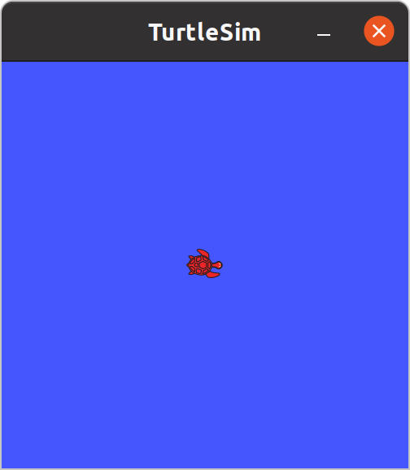
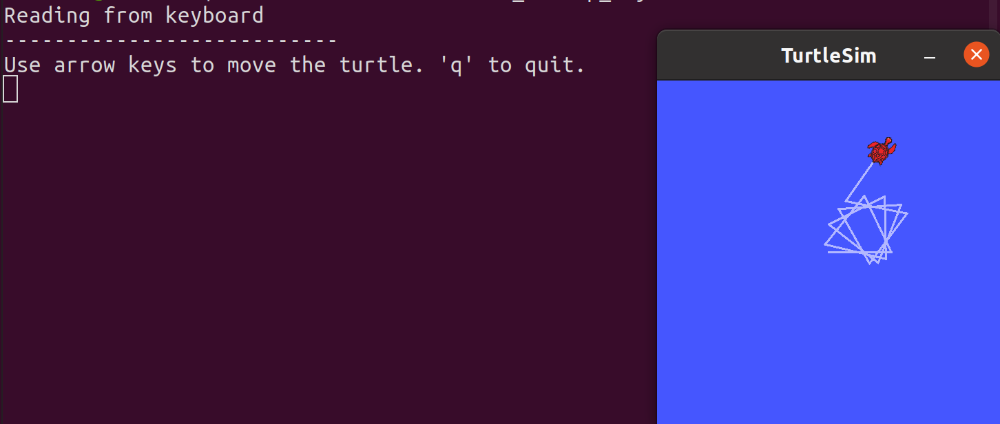
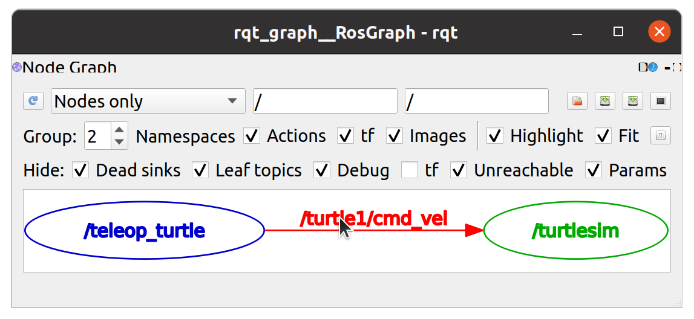
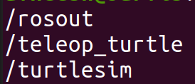
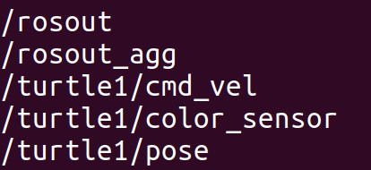
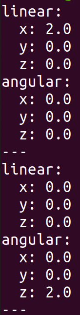
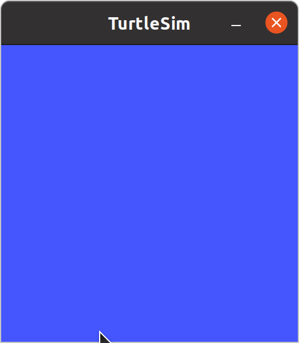

# Tutorial: Getting Started

The first tutorial on ROS. This file includes a tutorial for knowing the basic tools. It also describes key ROS concepts.

You do not need a ROS workspace, nor do you need to write a single line of code for this tutorial.

## Table of contents

- [Tutorial: Getting Started](#tutorial-getting-started)
    - [Table of contents](#table-of-contents)
    - [Tutorial: TurtleSim](#tutorial-turtlesim)
        - [Task 1: Launching roscore](#task-1-launching-roscore)
        - [Task 2: Control a turtle using Keyboard](#task-2-control-a-turtle-using-keyboard)
            - [Task 2.1: Visualizing](#task-21-visualizing)
        - [Task 3: Drawing a square](#task-3-drawing-a-square)
    - [Key concepts](#key-concepts)

## Tutorial: TurtleSim

For beginners, ROS comes preinstalled with a package called turtlesim. We shall be exploring the tasks here. If you see some new terms, it's good to refer the `Key concepts` [section](#key-concepts).

### Task 1: Launching roscore

Perform the following tasks on a terminal:

1. Run `roscore` (type `roscore` in the prompt and press enter). This will start the ROS server on your system. It is the centralized process that will handle everything from communications to handling parameters.

    ```bash
    roscore
    ```

### Task 2: Control a turtle using Keyboard

Since that terminal has gotten occupied, run the following on separate terminals:

1. Run the turtlesim node by executing the following command

    ```bash
    rosrun turtlesim turtlesim_node
    ```

    This launches a window showing a turtle, like what's shown below

    

2. To control this turtle using your keyboard, execute the node `turtle_teleop_key`.

    ```bash
    rosrun turtlesim turtle_teleop_key
    ```

    Using your arrow keys, you can now mode the turtle.

    

#### Task 2.1: Visualizing

To understand a little about the underlying mechanism that has caused this, you can run the following commands on separate terminals:

1. Launch `rqt_graph` which is used to give a peek at the ROS node graph (computation graph)

    ```bash
    rqt_graph
    ```

    A graph like the one shown below shall open

    

    The text in red is the name of a topic, in blue is the node publishing to the topic and in green is the node subscribing to the topic.

2. You can use `rosnode` to know about the nodes currently running on the ROS server.

    ```bash
    rosnode list
    ```

    The output of this should be the following

    

    These are names of the nodes running.

3. You can use `rostopic` tool to know mode about topics (through which they're communicating with each other)

    ```bash
    rostopic list
    ```

    The output of this should be the following

    

    You can even run another `rostopic` command while you use the keyboard to control the turtlesim node.

    ```bash
    rostopic echo /turtle1/cmd_vel
    ```

    The output looks like

    

    The messages are separated by a `---`.

### Task 3: Drawing a square

1. You can close the node for keyboard control, and then launch the `draw_square` node.

    ```bash
    rosrun turtlesim draw_square
    ```

    The turtle window must be drawing squares (the commands are now given by the node). The window must look something like this

    

2. To kill the turtle from the window, use a service created for the purpose.

    ```bash
    rosservice call /kill "name: 'turtle1'"
    rosservice call /clear
    ```

    This will make the turtle disappear, and then clear the window.

    

## Key concepts

From the main [README](./README.md), you have understood the following:

1. **Workspace**: A workspace consists of source code for packages, files built using those source code and many other items ROS related. It's everything in a single folder.
2. **Package**: A package is a folder that contains the source material for accomplishing a particular task.

You have learnt about the following terms in this tutorial:

- **roscore**: A command used to start the ROS Master (the central node), Parameter server (which handles various parameters for the system), and a rosout node (for debugging). More info [here](http://wiki.ros.org/roscore).
- **Node**: An executable belonging to a package, created to do a specific thing for a package.
- **Topic**: A channel through which data can be exchanged through different nodes known to the ROS Master. This data is exchanged as packets, where each individual packet has a structure.
    - **Message**: A single packet / structure of communication is called a message. The command `rosmsg list` would give a list of such messages on the system.
    - **Publisher**: Nodes that send data into the topic
    - **Subscriber**: Nodes that read data from the topic
- **Service**: A protocol designed to send a response from a server after receiving a request from a slave.
