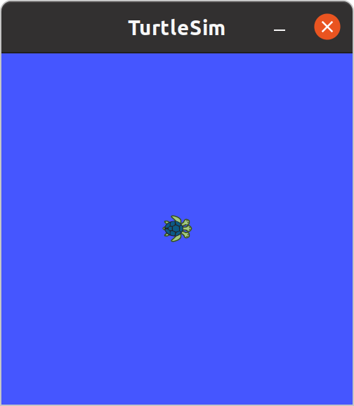
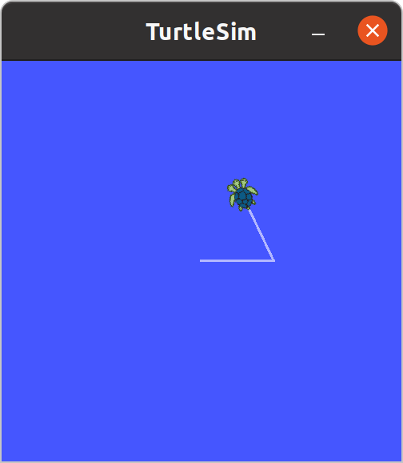
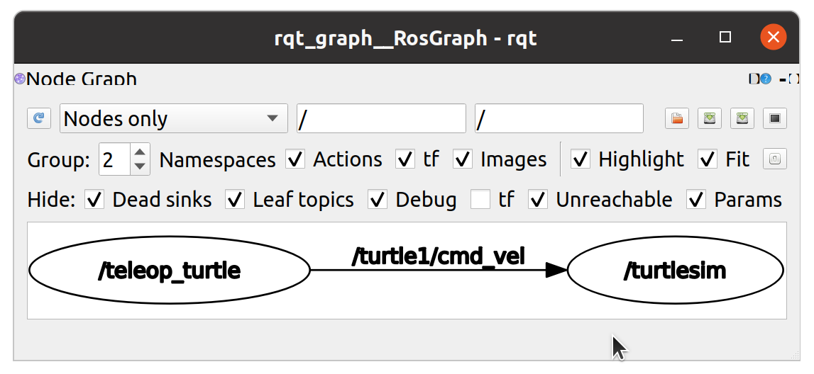

# Tutorial 0: Getting Started using TurtleSim

This tutorial explores basic concepts of ROS, without needing to write a single line of code.

## Table of contents

- [Tutorial 0: Getting Started using TurtleSim](#tutorial-0-getting-started-using-turtlesim)
  - [Table of contents](#table-of-contents)
  - [Foreword](#foreword)
  - [Turtlesim Tutorial](#turtlesim-tutorial)
    - [Starting everything](#starting-everything)
    - [Teleoperation](#teleoperation)
      - [visualizing the ROS Graph](#visualizing-the-ros-graph)
      - [Using Raw Messages](#using-raw-messages)
    - [Services](#services)
    - [Multiple turtles](#multiple-turtles)
      - [Remapping Arguments](#remapping-arguments)
  - [Conclusion](#conclusion)
  - [Reference](#reference)

## Foreword

Before getting started here, go through the [I0_Basic_Terminology.md](./I0_Basic_Terminology.md) file which explains basic ROS concepts. You may keep it for reference throughout this tutorial.

## Turtlesim Tutorial

For the purpose of exploring basic ROS concepts, a package called `turtlesim` is made. It enables you to get a peek without getting too much into coding.

> ROS wiki link to [turtlesim package](http://wiki.ros.org/turtlesim)

Let's start by setting up

### Starting everything

First, before running anything, it is important for the **ROS Master** to be running. This is the `roscore` program. Open a terminal and enter the following

```bash
roscore
```

After this, the terminal would show the status of the server. The following is written in the output

- It creates a logging directory, in the folder `~/.ros/log/`
- The server is started on a port on the machine. Something like `Localhost:39859`
- ROS communication is started. It handles the ROS "Graph" layer. More about that package [here](http://wiki.ros.org/ros_comm).
- At the end, the executable is given an PID by the operating system
- A `ROS_MASTER_URI` is created. This is useful in deploying ROS over a network of systems.

The current terminal is occupied, open a new one whenever the current one is occupied.

Let's start the turtlesim GUI. This is of course started as a node (as it is an executable). Nodes belong to a package. This one belongs to `turtlesim`. The node name for launching the GUI is `turtlesim_node`. To run a node, we use `rosrun`.

```bash
rosrun turtlesim turtlesim_node
```

This should open a GUI window as shown below



Along with this, it may also print out information about the spawned turtle. Keep this node open throughout this tutorial.

### Teleoperation

Teleoperation in this context means to control the robot using the keyboard. These is a node made exactly for that. The node is named `turtle_teleop_key` and is present in the same package. Run it using the following

```bash
rosrun turtlesim turtle_teleop_key
```

Once the node starts, you can move the turtle in the figure using the arrow keys in your keyboard. If you give `Up`, then `Left` and then `Up` again as input to the node (make sure that the node is selected and you can see the turtle), the following output can be seen



One important aspect to know is _how this is working_. All communication happens using topics. Use `rostopic` tool to deal with this. Run the following command on a separate terminal

```
rostopic list
```

This should show you the list of topics currently active (the master knows about these topics). We're interested in `/turtle1/cmd_vel`. To further know the details of a particular topic, use `rostopic info`

```bash
rostopic info /turtle1/cmd_vel
```

You'll see that `/turtlesim` has subscribed and `/teleop_turtle` is publishing to the topic. This means that when `/teleop_turtle` (the node `turtle_teleop_key`) publishes a message, `/turtlesim` (the GUI node) gets it and can make changes. To see the message structure (which the info command says is `geometry_msgs/Twist`), use `rosmsg`

```bash
rosmsg info geometry_msgs/Twist
```

This must display the contents of a Twist message (which ideally is used to represent linear and angular velocities).

> ROS wiki for `geometry_msgs` package [here](http://wiki.ros.org/geometry_msgs)

To see the exact values that the teleop node publishes, run the following command and keep it aside in a background viewable terminal

```bash
rostopic echo /turtle1/cmd_vel
```

This will actually create a node and will print out the messages being sent on that topic. To see active nodes, run

```bash
rosnode list
```

To view more details (like the URI of every node), run

```bash
rostopic list -a
```

This will show the active nodes in the output. You must see a node named like `/rostopic_NUMBER`. This is the node spawned by `rostopic echo` command executed earlier (if it is still running). Close that session and rerun the previous command, you shall not find that entry.

To know all information about a node, use `rosnode info`. Say we want to know more details about the `/turtlesim` node.

```bash
rosnode info /turtlesim
```

This would display the topic the node is publishing to, subscribing to and the services offered by the node (the node is the _Service Server_ for these services). Interestingly, it also shows the active connections in the graph (virtual communication graph managed by the ROS Master).

#### visualizing the ROS Graph

In a fairly simple graph, it may be simple to visualize them through terminal commands. But for complex systems, using `rqt_graph` is a better idea. You may launch it by either running `rqt_graph` or by running it through `rosrun`.

```bash
rosrun rqt_graph rqt_graph
```

In both cases, an `/rqt_gui_py_node` is run as a node. It must show a figure like this



This must show you the ROS communication graph (hopefully you have the teleop node still running).

Now that you're done exploring teleoperation, you can close the `turtle_teleop_key` (node name `/teleop_turtle`). The usual informal way to kill a node is through `Ctrl + C`, but the formal and graceful termination must be done through `rosnode kill`

```bash
rosnode kill /teleop_turtle
```

After the successful termination message, you can refresh the `rqt_graph` GUI (refresh icon in the top left corner). It must now show only the `/teleop_turtle` graph. After that, the terminal where `turtle_teleop_key` can be closed.

#### Using Raw Messages

So far, you've seen how to use the keyboard and control the turtle. But that was using a node (the `turtle_teleop_key` node). You can however directly create and send messages to the `/turtle1/cmd_vel` topic (without creating a node). Use `rostopic pub` to publish messages to a topic (you can find the help of this and virtually any other command using `-h`). It may be a good idea using `tab` to autocomplete some of the part of the following command.

```bash
rostopic pub /turtle1/cmd_vel geometry_msgs/Twist "linear:
  x: 1.0
  y: 0.0
  z: 0.0
angular:
  x: 0.0
  y: 0.0
  z: 0.0" -1
```

This should move the turtle forward. You can try giving angular rotations through `angular:z:` in the message. Without the `-1` option, the message would be latched, that is it would be published and the rostopic node created would not automatically terminate. This option allows you to terminate the node created by `rostopic pub` without using `rosnode kill` or `Ctrl + C`.

### Services

Now that you've seen topics and messages and have a gist of how they work, we can explore services. Services work on a request and response model. To see the services that are currently _servable_, use `rosservice`

```bash
rosservice list
```

This must show all active services known to the master (`roscore` running all along). Let's clear the lines drawn by the turtle. Use service `/clear` for this. To call a service from the terminal, use `rosservice call`. Run the following command

```bash
rosservice call /clear {}
```

This should have cleared the lines drawn by the turtle. There is another service called `/turtle1/teleport_absolute` which lets you teleport the turtle. To know more about it, use `rosservice info`

```bash
rosservice info /turtle1/teleport_absolute
```

This would show the type of service (note that services are defined in `.srv` files inside packages). It would also show the arguments taken by the service. To more about the particular `.srv` file (to know the request and response details), use `rossrv info`

```bash
rossrv info turtlesim/TeleportAbsolute
```

This would show the request messages of the service followed by the response messages.

> The tool `rosservice` should not be confused with `rossrv` (which shows services defined in different packages).

Let's first deactivate the pen (using which the turtle draws). This is done using the service `/turtle1/set_pen`

```bash
rosservice call /turtle1/set_pen "{r: 0, g: 0, b: 0, width: 0, 'off': 1}"
```

Now the turtle would not draw on the screen (you can test using teleoperation). Let's move the turtle to its original spawning position and orientation

```bash
rosservice call /turtle1/teleport_absolute "x: 5.54444
y: 5.544444
theta: 0.0"
```

This would move the turtle to the home position. To let it draw again, run

```bash
rosservice call /turtle1/set_pen "{r: 255, g: 255, b: 255, width: 2, 'off': 0}"
```

You can choose whatever color you prefer (experiment). But you can observe that the turtle is drawing again when it is moved.

You can kill the turtle (remove it from the board) from the following commands

```bash
rosservice call /kill "name: 'turtle1'"
rosservice call /clear
```

This would kill the turtle and then clear the screen.

### Multiple turtles

To spawn a turtle, you can use the `/spawn` service.

```bash
rosservice call /spawn "x: 5.54444
y: 5.54444
theta: 0.0
name: 'turtle_1'"
```

You will observe that since this is service of type `turtlesim/Spawn`, it has a response (the name of the turtle spawned). The response is shown in the terminal. The terminal which has the `turtlesim_node` running would also reflect this.

You shall notice that every turtle has its own `cmd_vel` topic and many services seen before. This is a nice feature to have for multiple objects that need to be individually controlled.

#### Remapping Arguments

Try running `turtle_teleop_key` and performing the teleoperation of our newly created turtle. It doesn't work (see the `rostopic list` for why). Remember that `turtle_teleop_key` publishes to `/turtle1/cmd_vel` by default. There is a simple remapping feature that lets you remap the topics of a publisher without having to change the names everywhere in the source code and rebuilding everything. It is called argument remapping.

> More on Remapping Arguments on [roswiki](http://wiki.ros.org/Remapping%20Arguments#Remapping_Arguments)

To use the `turtle_teleop_key` with the turtle which we created, run it like this

```bash
rosrun turtlesim turtle_teleop_key /turtle1/cmd_vel:=/turtle_1/cmd_vel
```

Now, the node `/teleop_turtle` should be publishing messages to `/turtle_1/cmd_vel` instead of `/turtle1/cmd_vel` (remapped the topic). Now you can create as many turtles as you want and control them using the keyboard. Note that only one `/teleop_turtle` node can be launched (so you can control only one turtle at a time).

## Conclusion

This concludes the tutorial, you may now close the `/turtlesim` node (use `rosnode kill`) and then close the ROS Master (use `Ctrl + C` here). In this tutorial, the following was covered

- Starting the ROS Master (`roscore`)
- Running nodes
- Topics and messages
- Services
- Remapping arguments associated to a node

## Reference

- All geometry_msgs through [roswiki](http://wiki.ros.org/geometry_msgs)
- Main turtlesim [roswiki](http://wiki.ros.org/turtlesim)
